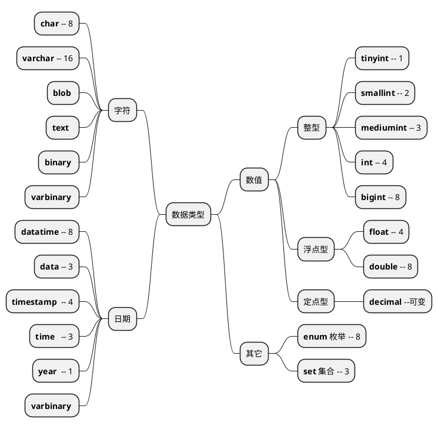
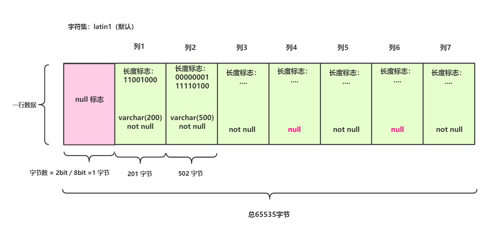
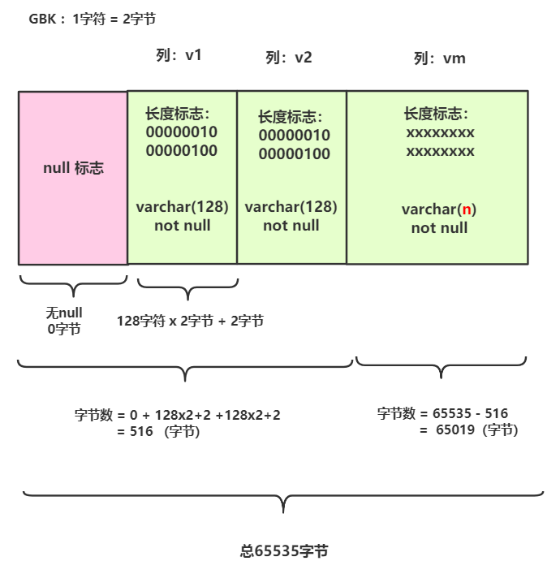

```sql

CREATE DATABASE security DEFAULT CHARSET utf8 COLLATE utf8_general_ci;

```

## 1. 基本概念

### 1.1. SQL 分类

```sql
DDL (Data Definition Language)  : create、drop、alter
DCL (Data Control Language)     : select、insert、update、delete、
                                  execute、references、usage
DML (Data Manipulation Language) :  CRUD
TCL (Transaction Control Language) : commit、rollback
```

## 2. 数据类型



### varchar最大长度计算

```sql
varchar长度 =（ 最大长度 - null标志位 - 长度标志位 ） / 字符集单个字符

最大长度    : 65535
null标志位  : 每列1个标识，占1个bit（每8个bit为1个字节，不满也为1个字节）
             占用字节数 = （标志位 /8）
             存放于行最开始的位置。
长度标志位  : 长度 0 - 255(2^8) 1个字节
            长度 256 - 65535(2^16) 2个字节，且

```

>字符集单个字符所占字节 ：
latin1 : 单个字符可占1个字节
GBK : 单个字符最大可占2个字节
UTF8 ：单个字符最大可占3个字节
UTF8MB4 ：单个字符最大可占4个字节 (大部分中文占3个字节)



🔹 案例：

```sql
create table test_varchar_length(
     v1 varchar(128) not null,
     v2 varchar(128) not null,
     vm varchar( n ) not null
) CHARSET=GBK;

n的值最大为多少？
```



由于列vm字节数 65019 > 127 ，所以需2个字节来记录65019，即长度标志为2个字节。由于字符集为GBK编码，所以 n = (65019 -2) /2  = 32508.5。向下取整，得 n = 32508。

[👉参考博客](https://learn.blog.csdn.net/article/details/103341778)

## 3. 存储过程

```sql
==========================定义存储过程==========================
DELIMITER 新结束符

CREATE PROCEDURE 过程名 ( [[IN | OUT | INOUT] 参数名 参数类型]  )
BEGIN

END
-- 重新设置为 ; 结束符
DELIMITER ; 

============================调用=================================
CALL 数据库名称.存储过程名称 (参数列表)

============================查看=================================
SHOW PROCEDURE STATUS [LIKE 匹配模式]\G
SHOW CREATE PROCEDURE 过程名称

====================修改（无法修改参数和主体）=======================
ALTER PROCEDURE 存储过程名称 [特征]

===============================删除================================
DROP PROCEDURE [IF EXISTS] 存储过程名称
```

## 4. SQL编程

```sql
===============================参数=================================

1.系统变量
SHOW VARIABLES [ LIKE '匹配模式' | WHERE ]
-- 局部
SET 变量名 = 值
-- 全局
SET GLOABAL 变量名 = 值
--------------------------------------------
2.用户变量（会话变量）
--  查看
SELECT @变量名.@变量名...
-- 设置
SET @变量名 = 值
SELECT ... INTO @变量名 //可设置JSON
--------------------------------------------
3.局部变量
DECLARE 变量名1 [,变量名2...]  类型  [ DEFALUT 默认值 ]

==============================逻辑语句=================================
1.IF语句
if search_condition then
    statement_list
[elseif search_condition then
    statement_list]
...
[else
    statement_list]
end if;

--------------------------------------------
2.CASE语句
CASE value WHEN [compare-value] THEN result
[WHEN [compare-value] THEN result ...]
[ELSE result]
END

--------------------------------------------
3.LOOP 、REPEAT、WHILE 循环语句

[标签名:] LOOP
    LEAVE 标签名
END LOOP [标签名]

[标签名:] REPEAT
    语句
UNTIL REPEAT [标签名]

[标签名:] while 条件 do
    LEAVE 标签名
    iterate 标签名
end while [标签名];

--------------------------------------------
4. 跳转语句
iterate 标签名 : 跳出循环
leave 标签名   : 跳出循环 和  BEGIN..END
```

## 5. 函数

[参考--函数](https://www.yiibai.com/mysql/functions.html)

### 5.1 日期函数

|函数名称|含义|补充|
|-|-|-|
|now()|获取当前时间||
|year(time)|获取年份||
|month(time)|获取月份||
|day(time)|获取日期||
|dayname(time)|获取星期数|
|timestampdiff(year\|month\|day,时间1,时间2)|计算两个时间的差值|
