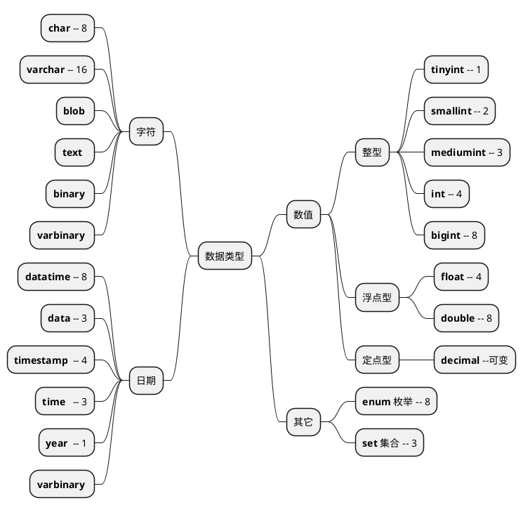

```sql

CREATE DATABASE security DEFAULT CHARSET utf8 COLLATE utf8_general_ci;

```



#### varchar最大长度计算

```sql
varchar长度 =（ 最大长度 - null标志位 - 长度标志位 ） / 字符集单个字符

最大长度    : 65535
null标志位  : 每列1个标识，占1个bit（每8个bit为1个字节，不满也为1个字节）
             占用字节数 = （标志位 /8）
             存放于行最开始的位置。
长度标志位  : 长度 0 - 255(2^8) 1个字节
            长度 256 - 65535(2^16) 2个字节，且

```
>字符集单个字符所占字节 ： 
latin1 : 单个字符可占1个字节
GBK : 单个字符最大可占2个字节
UTF8 ：单个字符最大可占3个字节
UTF8MB4 ：单个字符最大可占4个字节 (大部分中文占3个字节)


🔹 案例：

```
create table test_varchar_length(
     v1 varchar(128) not null,
     v2 varchar(128) not null,
     vm varchar( n ) not null
) CHARSET=GBK; 

n的值最大为多少？
```


由于列vm字节数 65019 > 127 ，所以需2个字节来记录65019，即长度标志为2个字节。由于字符集为GBK编码，所以 n = (65019 -2) /2  = 32508.5。向下取整，得 n = 32508。

[👉参考博客](https://learn.blog.csdn.net/article/details/103341778)

