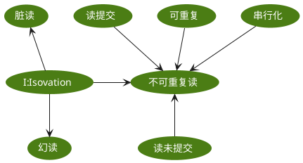

```puml
@startuml

skinparam usecase {
    BackgroundColor #4b7d14
    BorderColor #4b7d14
    FontColor #fff

    BackgroundColor<< Main >> YellowGreen
    BorderColor<< Main >> YellowGreen
}

(I:Isovation) as (I)
(I)-up->(脏读)
(I)-right->(不可重复读)
(I)-->(幻读)

(读未提交) as (au)
(读提交) as (rc)
(可重复) as (rr)
(串行化) as (s)

(au) -up->  (不可重复读)
(rr) -->  (不可重复读)
(rc) -->  (不可重复读)
(s) -->  (不可重复读)

@enduml
```
