#

## 1. 基本概念

## 2. 使用

### 2.1. ik分词器

ik_smart 最少切分

ik_max_word

自带（keyword、standard）

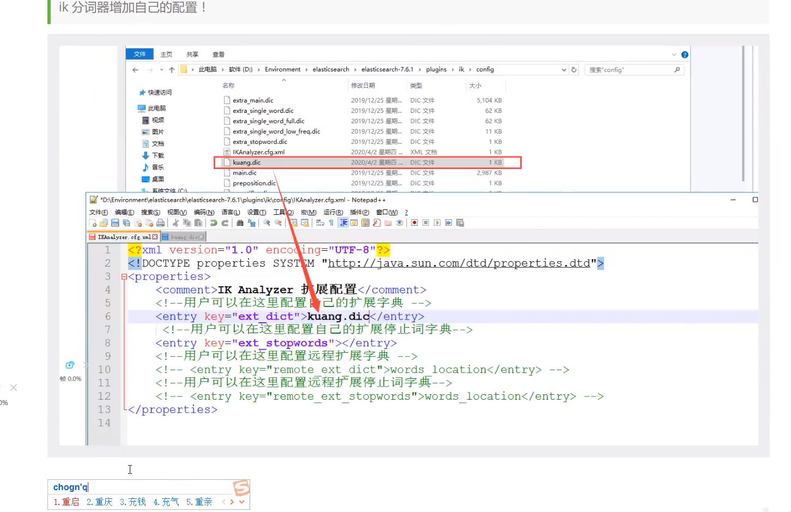

### 2.2. 索引CRUD

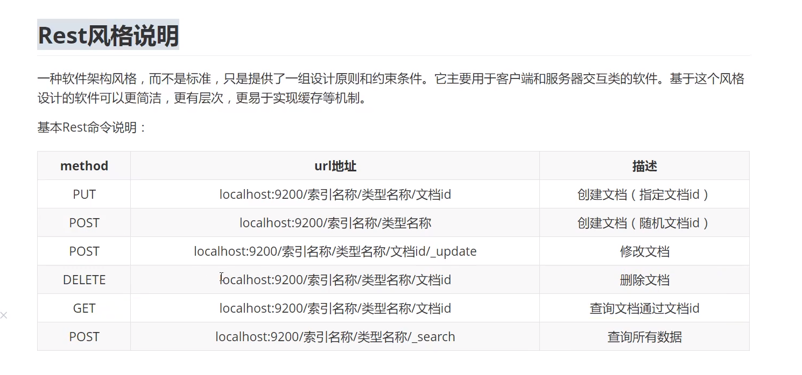

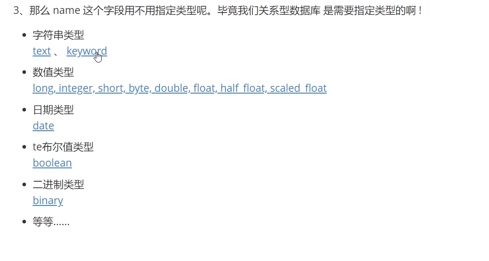

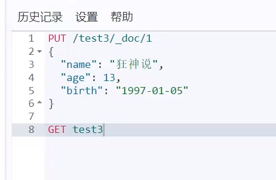

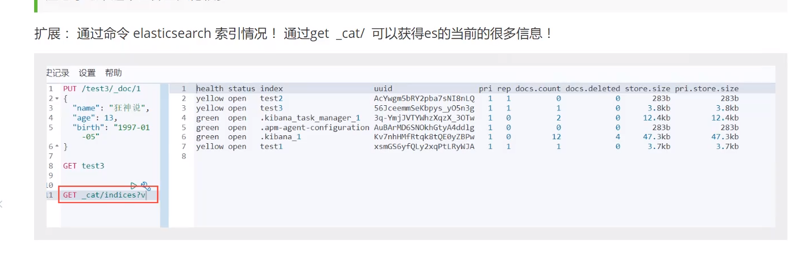

### 修改

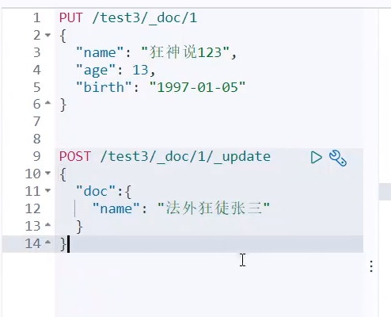

### 删除

### 2.3. 文档CRUD

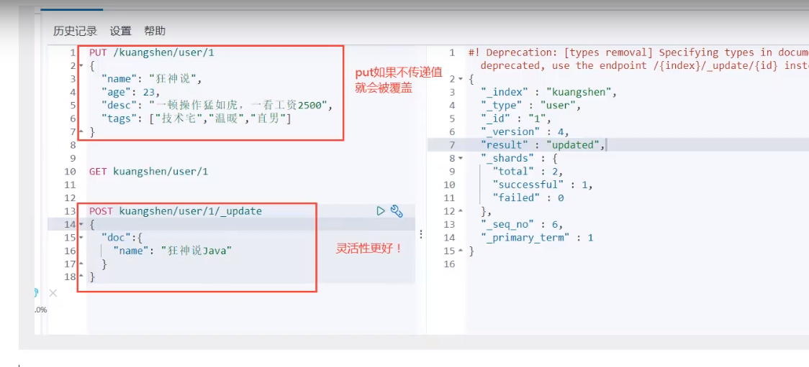

#### 查询

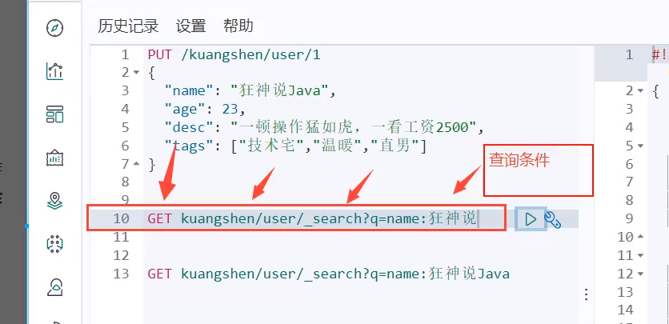

##### 复杂查询

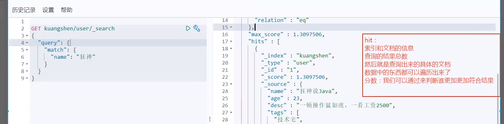

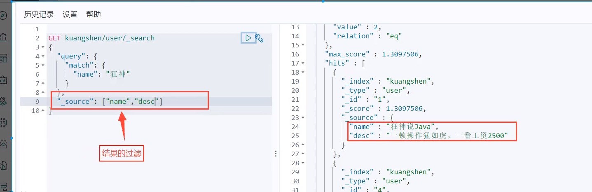

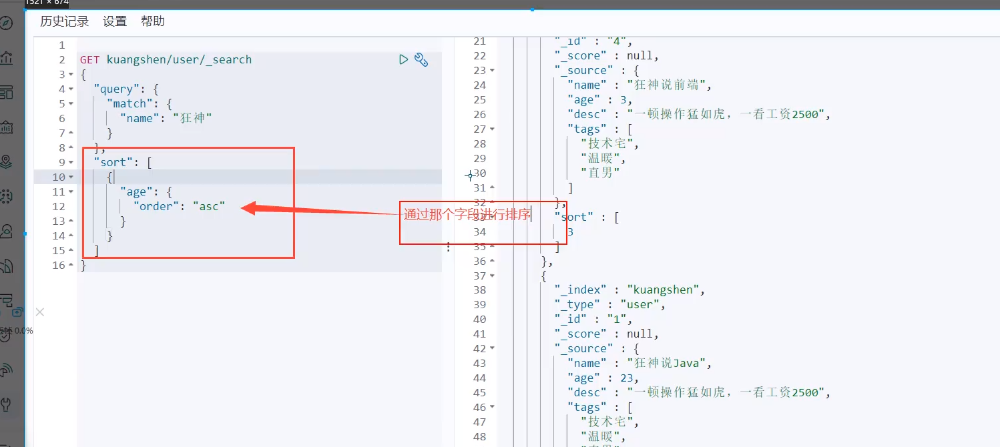

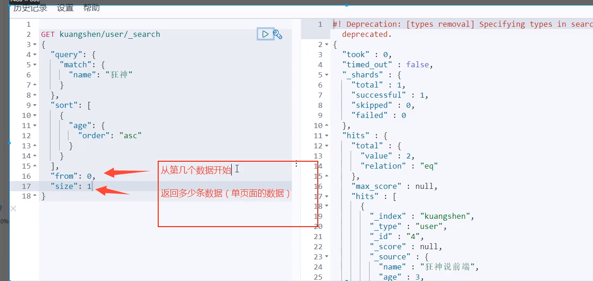

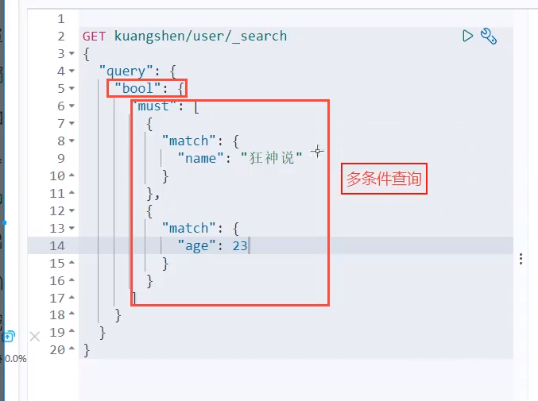

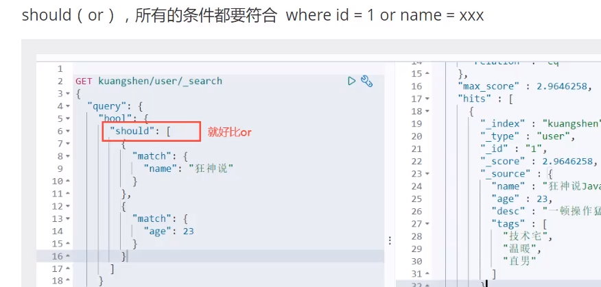

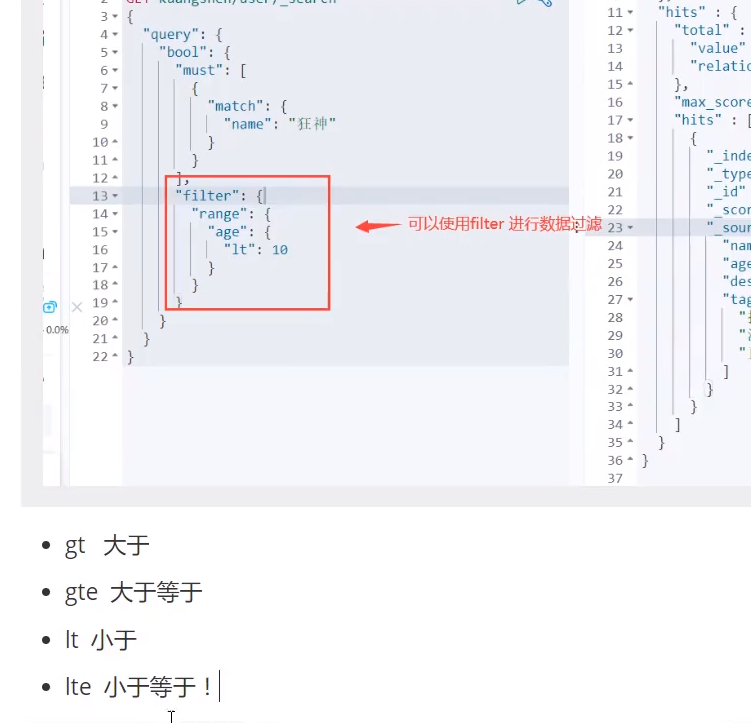

精确查询

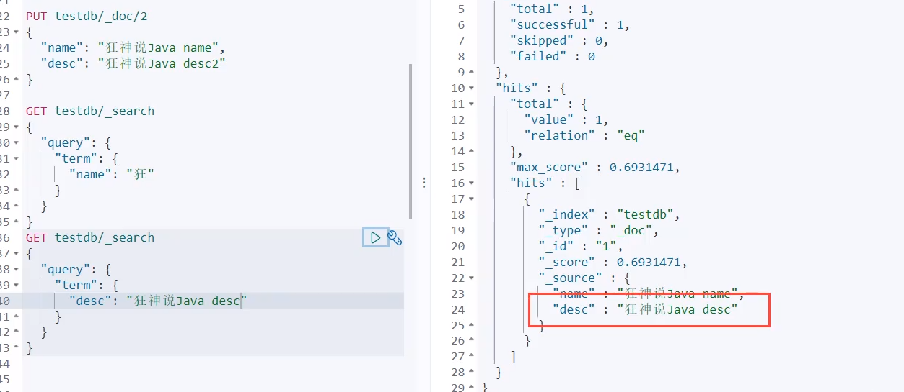
keyword精确匹配

多值精确
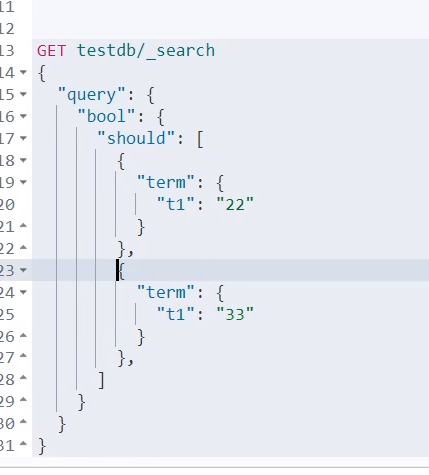

### 高亮

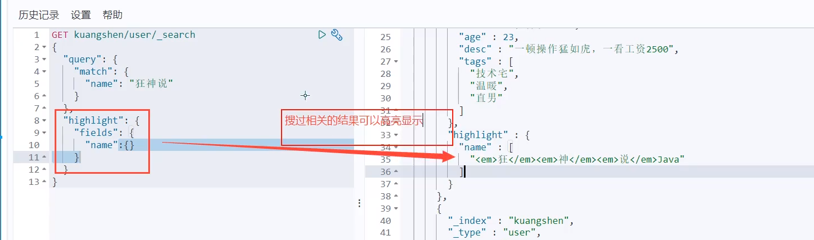

#### 自定义样式

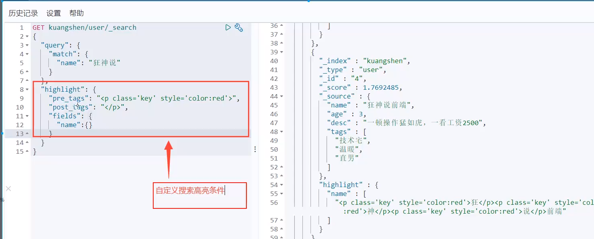
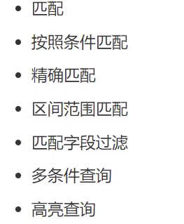