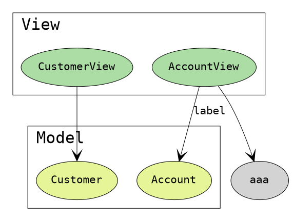
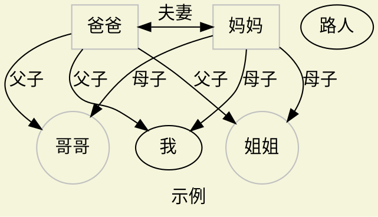
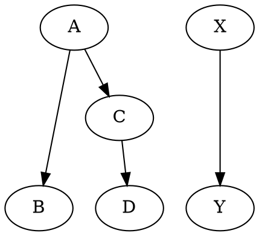
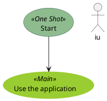

```puml

digraph a{
    graph [nodesep=0.5,fontname="Inconsolata, Consolas", fontsize=15, penwidth=0.5, labeljust=left]
    node [shape=ellipse, fontname="Inconsolata, Consolas", fontsize=10, penwidth=0,
        style=filled, colorscheme=spectral9]
    edge [fontname="Inconsolata, Consolas", fontsize=10, penwidth=0.5]

    subgraph clusterModel {
        label="Model"
        node [fillcolor=7]
        a,b,c
        { rank="min" a,c }

    }

    /* Unidirecitonal association */
    {
        a->b
        a->c
    }
}

```

[](https://itopic.org/graphviz.html)

### rank值

|值|含义|
|-|-|
|same|同级|
|max|最底部|
|min|最顶部|

### 颜色主题 colorshceme

[官方colorshceme](https://graphviz.org/doc/info/colors.html)

### 形状 shape

|值|含义|
|-|-|
|box|矩形|
|ellipse|椭圆形|
|circle|圆行|
|parallelogram|平行四边形|

[官方shape](https://graphviz.org/doc/info/shapes.html)