#  JVM
  
  

```
Error: imagemagick-cli failure
Error: Failed to call 'convert C:\Users\JIANXI~1\AppData\Local\Temp\mume-svg2020412-12464-5puxid.5rvdg.svg D:\Learning\MyNote\assets\b179a2325140068a9e2f9b48e9b5b9c10.png', which was mapped to '"C:\Windows\System32\convert.exe" C:\Users\JIANXI~1\AppData\Local\Temp\mume-svg2020412-12464-5puxid.5rvdg.svg D:\Learning\MyNote\assets\b179a2325140068a9e2f9b48e9b5b9c10.png'. Error is 'Command failed: "C:\Windows\System32\convert.exe" C:\Users\JIANXI~1\AppData\Local\Temp\mume-svg2020412-12464-5puxid.5rvdg.svg D:\Learning\MyNote\assets\b179a2325140068a9e2f9b48e9b5b9c10.png
������ - D:\Learning\MyNote\assets\b179a2325140068a9e2f9b48e9b5b9c10.png
'.

Please make sure you have ImageMagick installed.
```  

  
##  一、架构图
  
  
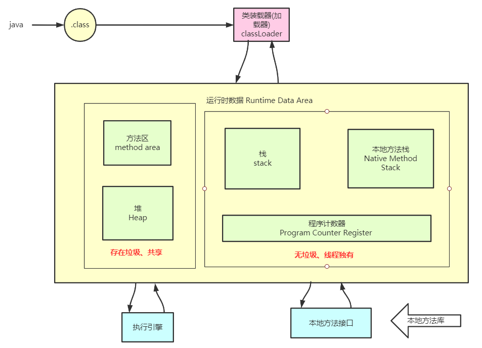
  
##  二、类加载
  
  
###  1、类加载过程
  
  
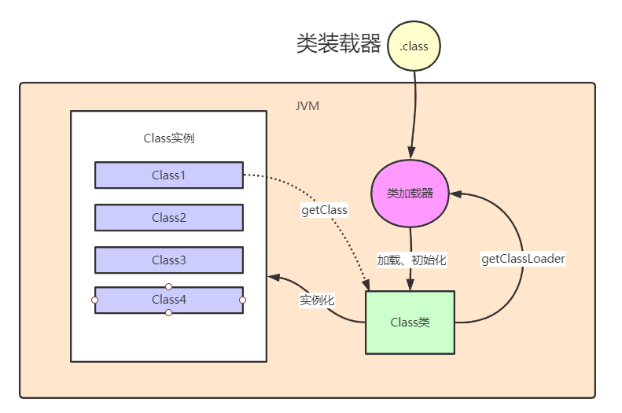
  
###  2、类加载器
  
  
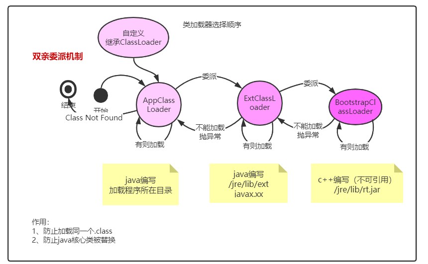
  
###  3、安全机制——沙盒安全机制
  
  
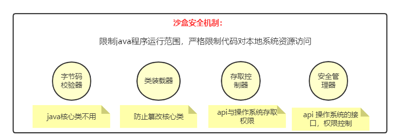
  
##  三、 本地方法栈（Native Method Stack）
  
  
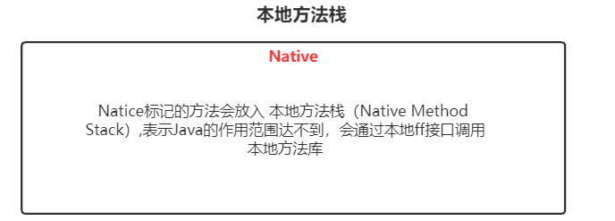
  
##  四、程序计数器（Program Counter Register）
  
  
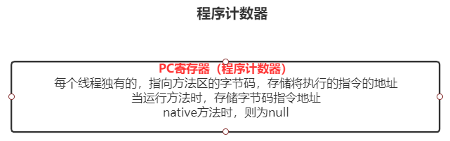
  
##  五、栈（stack）
  
  
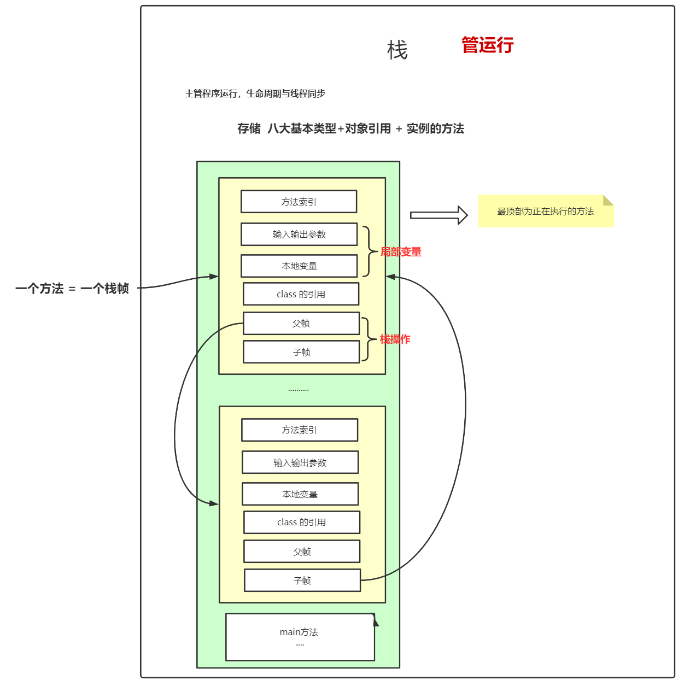
  
##  六、方法区（Method area）-1.7 / 元空间（Metaspace）-1.8
  
  
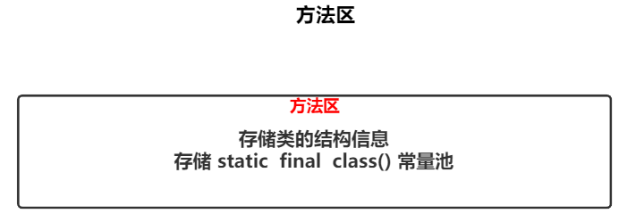
  
##  七、堆（deap）
  
  
###  1、堆的结构图
  
  
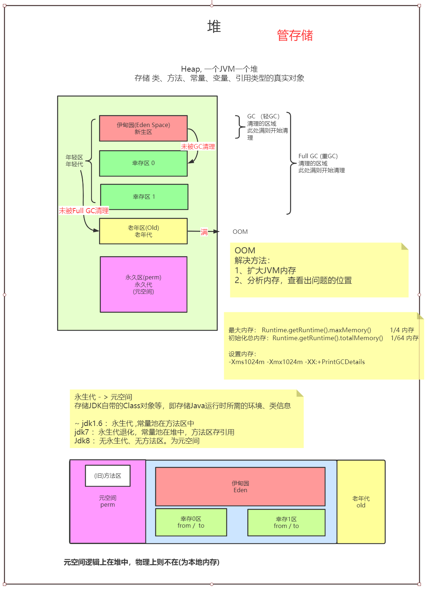
  
###  2、GC算法
  
  

```
Error: imagemagick-cli failure
Error: Failed to call 'convert C:\Users\JIANXI~1\AppData\Local\Temp\mume-svg2020412-12464-11qdc7g.a03n.svg D:\Learning\MyNote\assets\b179a2325140068a9e2f9b48e9b5b9c10.png', which was mapped to '"C:\Windows\System32\convert.exe" C:\Users\JIANXI~1\AppData\Local\Temp\mume-svg2020412-12464-11qdc7g.a03n.svg D:\Learning\MyNote\assets\b179a2325140068a9e2f9b48e9b5b9c10.png'. Error is 'Command failed: "C:\Windows\System32\convert.exe" C:\Users\JIANXI~1\AppData\Local\Temp\mume-svg2020412-12464-11qdc7g.a03n.svg D:\Learning\MyNote\assets\b179a2325140068a9e2f9b48e9b5b9c10.png
������ - D:\Learning\MyNote\assets\b179a2325140068a9e2f9b48e9b5b9c10.png
'.

Please make sure you have ImageMagick installed.
```  

  
- 最初的算法：引用计数器
  
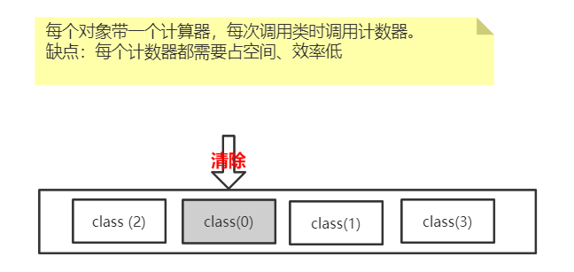
  
####  2.1、复制算法
  
  
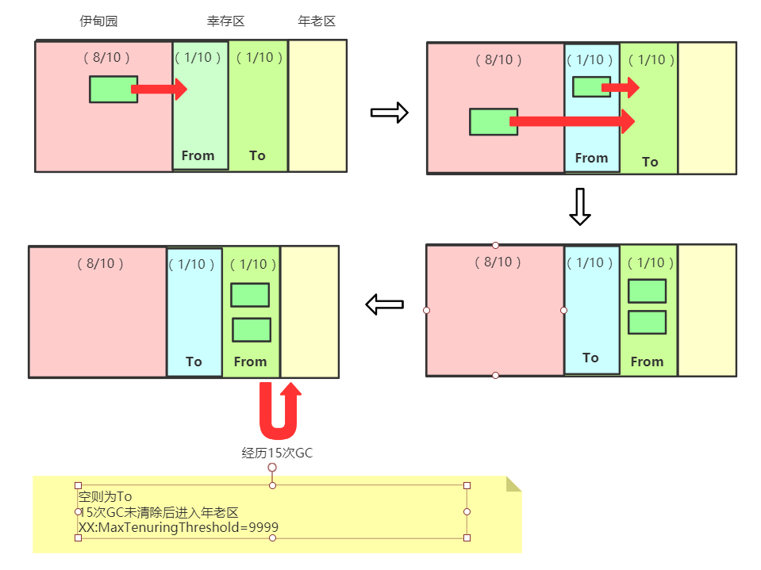
  
####  2.2、标记清除算法
  
  
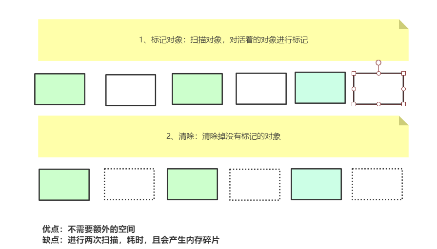
  
####  2.3、标记压缩算法
  
  
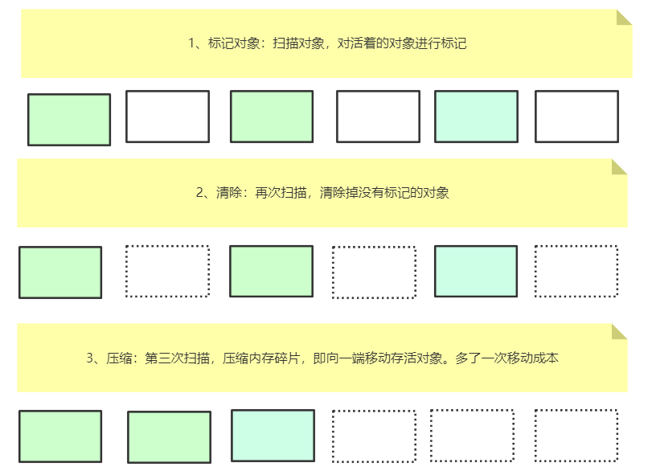
  
####  2.4、分代搜集算法
  
  
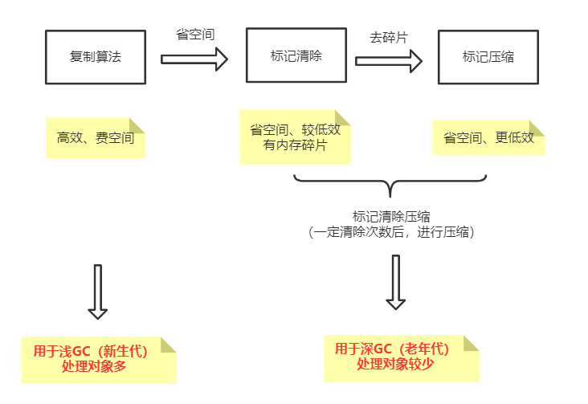
  
  
###  3、调优参数
  
  
-Xms1024m   初始化内存分配大小   1/4
-Xmx1024m   最大分配内存  1/64
-XX:+PrintGCDetails
-XX:+HeapDumpOnOutOfMemoryError 捕获、输出堆内存溢出异常
-XX:MaxTenuringThreshold=9999   设置进入老年区的浅GC次数
  