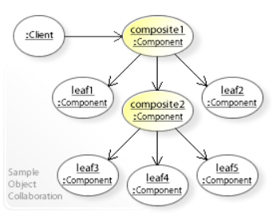
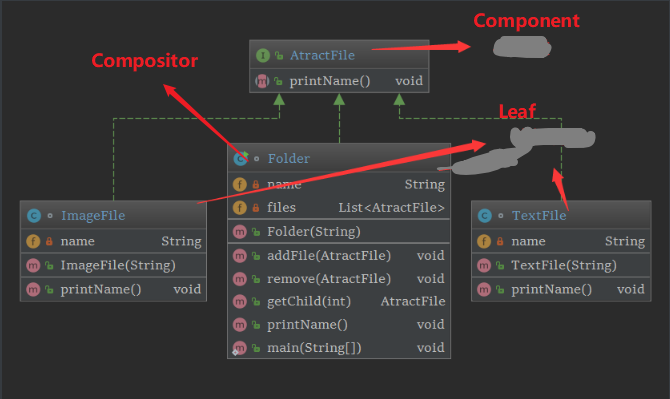

# <font color=#3caf50> 组合模式</font>

## <font color=#3caf50> 1、作用</font>

解决树状结构组合的问题.
通过树状

## <font color=#3caf50>2、实现：</font>

   模拟树状结构，需要节点、子叶，以及节点和子叶的超类，来实现各个节点的嵌套。

- 组件
    1. Component
    2. Compositor



```puml
    skinparam backgroundColor Beige
    skinparam sequenceMessageAlign center
    namespace safety #DDDDDD {
        class Component{
            + operation()
        }
        class Compositor{
            - List<Component> list
            + add(Component)
            + getChlid():Component
            + operation()
        }
        class Leaf{
            + operation()
        }
        class Client

        Component <|-- Compositor
        Component "0..n" -- "1" Compositor
        Component <|-- Leaf
        Client -- Component
    }
```

```puml
    skinparam backgroundColor Beige
    skinparam sequenceMessageAlign center
    namespace uniformity_noSafety #DDDDDD {
        class Component{
            - List<Component> list
            + add(Component)
            + getChlid():Component
            + operation()
        }
        class Compositor{
            - List<Component> list
            + add(Component)
            + getChlid():Component
            + operation()
        }
        class Leaf{
            - List<Component> list
            + add(Component)
            + getChlid():Component
            + operation()
        }
        class Client

        Component <|-- Compositor
        Component "0..n" -- "1" Compositor
        Component <|-- Leaf
        Client -- Component
    }
    note top: 统一操作、不安全Leaf
```

其它例子：

