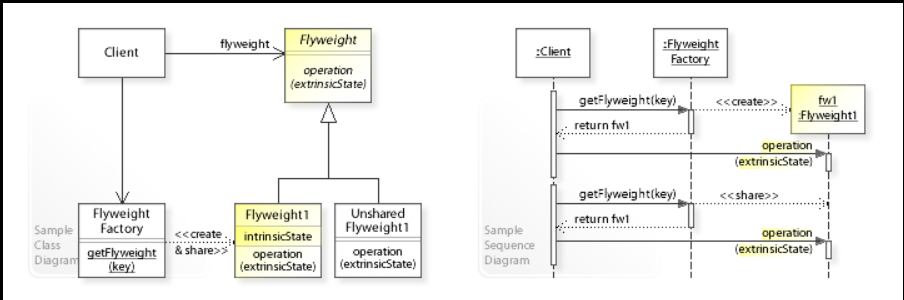

# <h1 align='center' style='color:#4cAF50;font-size:40px'> Flyweight 享元模式</h1>

## <font color=#3caf50>1、作用</font>

- 共享对象、重复利用
- 解决对相同对象重复创建的问题。
- 对于相同的对象只需一个共享对象的备份，无需再次实例。
- 当需多次、大量地使用相同的对象时使用。

## <font color=#3caf50>2、实现</font>

组件

1. 享元工厂
2. 抽象享元
3. 具体享元

此图片来源 👉[维基百科](https://en.wikipedia.org/wiki/Flyweight_pattern)



## <font color=#3caf50>3、模式的扩展</font>

- 通过简单工厂模式创建享元对象。
- 通过静态工厂模式对外提供享元工厂。
- 由于通常只存在一个工厂，故也运用到单例模式
- 在享元复用中，则需要使用到组合模式。

```puml
      skinparam backgroundColor Beige

      class FlayWeight_ABABA
      class A
      class B
      FlayWeight_ABABA <|-- A
      FlayWeight_ABABA <|-- B
      FlayWeight_ABABA <|-- ABA
      FlayWeight_ABABA "1..n" -- "1" ABA
      class FlayWeight_ABABA
      FlayWeight_ABABA --o FlayWeightPools

      class FlayWeight_xxx
      FlayWeight_xxx --o FlayWeightPools

      class client
      client -- FlayWeightPools

```
