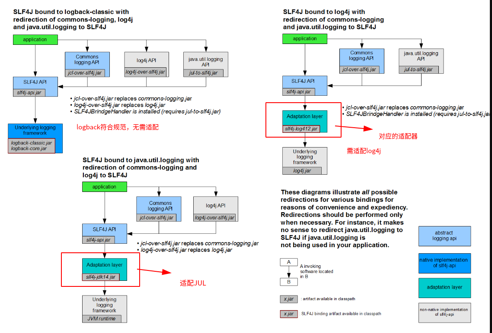

# 适配器模式

## 一、功能

实现将某个类适配到特定接口的功能。
`适配器 = 特定类功能 + 特定接口`

1. 封装某个类（实现特定接口，对类的各个方法进行再次封装）
2. 统一多个类（含类似的方法功能）
    为各个类创建适配器，由于各个适配器实现同一个接口，故可用多态的方式来统一调用多个类方法。
3. 替换、修改类的方法实现
    通过适配器实现与原有类相同的接口，再在适配器中修改相应方法的实现。

## 二、实现

要求：Adaptee类适配Base类（将Adaptee的方法实现添加到Base中）

实现方式分为两种，一种是通过继承的方式，另一种是通过组合的方式。

<b> 1. 共同点: </b>

- 都是通过实现被适配者（Base）的接口来作为Base的适配器

<b> 2. 差异: </b>

两者的差异在适配器对适配者类和被适配者类中相同方法的实现。

- 继承：相同的方法，无需再实现
- 组合：所有方法都需要，再实现。

### 类图1：继承方式

<!-- ```puml
    skinparam backgroundColor Beige

    class Adaptor{
        void a(
        \tsuper.a_1()
        )
    }
    note right : 适配器
    interface Base{
        void a()
        void b()

    }
    note left : 被适配者
    class Adaptee{
        void a_1()
        void b()
    }
    note left : 适配者
    Adaptor ..|> Base : 实现
    Adaptor --|> Adaptee : 继承
    Main - Adaptor
``` -->


### 类图2：组合方式

<!-- ```puml
    skinparam backgroundColor Beige

    class Adaptor{
        Adaptee adaptee;
        void a(
        \tadaptee.a_1()
        )
        void b(
        \tadaptee.b()
        )
    }
    note right : 适配器
    interface Base{
        void a()
        void b()
    }
    note left : 被适配者
    class Adaptee{
        void a_1()
        void b()
    }
    note left : 适配者

    Adaptor ..|> Base : 实现
    Adaptor --* Adaptee : 组合
    Main - Adaptor
``` -->


## 三、案例

### SLF4j适配日志框架

&emsp;&emsp;SLF4j是日志框架的接口规范，作为日志框架对外使用的门面。其不包括日志框架内容的实现，需要依赖其它日志实现框架。例如Logback。

| 日志门面（日志的接口规范）| 日志实现|
|-|-|
| SLF4j | Log4j、JUL(java.util.logging)、Log4j2、Logback|

&emsp;&emsp;但由于部分日志实现框架并不按照SLF4j的规范来实现，所有SLF4j需要对各个日志实现框架进行适配，如Log4j2、JUL。
&emsp;&emsp;例如，SLF4j使用Log4j2时，需要slf4j-log4j2.jar来实现Log4j2适配SLF4j的接口。通过slf4j-log4j2.jar提供适配器类实现SLF4j的接口，并调用Log4j2的实现。

<!--  -->


