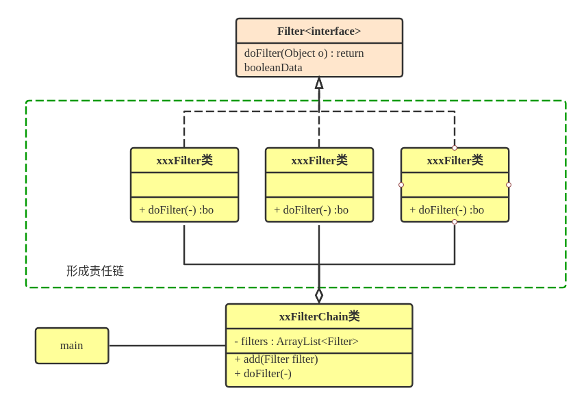

# 责任链模式

## 一、功能

&emsp;&emsp;责任链模式指的是：将对同一个内容的多个处理操作拆分为多个处理者执行，并将其串联成一条执行链。每个处理者都有其对应、独立的职责。在处理内容时，则通过这条责任链，依次获取处理者的引用，完成相应的操作。

<t>责任链处理流程的终止方式可分为两种：</t>

1. 完成一次处理操作（成功|失败），则终止。
2. 处理完所有的处理操作。
    如下图中，一桶水（被处理的内容）在链上的人物（处理者）之间依次传递、倒水（处理内容），无论是否可以倒水（能否被处理）都将传递给下一位处理者，直到所有处理者都处理了一遍。


此图片来源：👉[refactoringguru.cn](https://refactoringguru.cn/design-patterns/chain-of-responsibility)

## 二、实现

在实现链上各节点的关系上，可分为数组或链表两种实现。

### 方式一：数组存储节点关系

<!-- 
```puml
    skinparam backgroundColor Beige
    Interface Handler{
        do()
    }

    class Handler1{
        do()
    }
    note left : 处理器1

    class Handler2{
        do()
    }

    class Handler3{
        do()
    }

    class HandlerChain{
        Handler[] handlers;
        do();
    }
    note left : 处理器管理类
    note left of HandlerChain
        void do(){
            for(handler:handlers){
                handler.do();
            }
        }
    end note
    class main

    Handler1 ..|> Handler
    Handler2 ..|> Handler
    Handler3 ..|> Handler

    Handler --o HandlerChain
    main -> HandlerChain : 调用
```  -->


### 方式二：链表形成节点关系

<!-- ```puml
    skinparam backgroundColor Beige
    Interface Handler{
        getNext();
        setNext(Handler handler);
        do();
    }

    class Handler1{
        getNext()
        setNext(-)
        do()
    }
    note left : 处理器1

    class Handler2{
        getNext()
        setNext(-)
        do()
    }

    class Handler3{
        getNext()
        setNext(-)
        do()
    }

    class HandlerChain{
        Handler first;
        do();
    }
    note left : 处理器管理类
    note left of HandlerChain
        void do(first){
            first.do();
            do(first.getNext()); //递归
        }
    end note
    class main

    Handler1 ..|> Handler
    Handler2 ..|> Handler
    Handler3 ..|> Handler

    Handler --o HandlerChain
    main -> HandlerChain : 调用
``` -->


## 三、案例

### 1, 简易过滤器

&emsp;&emsp;假设，需要对一个内容进行过滤。我们可将过滤的操作拆分为多个过滤操作（过滤器xxxFilter）。各个过滤器实现对应的过滤操作（doFilter），再通过过滤链（XXFilterChain）来将各个过滤器联系、串联起来，进行过滤操作。通过这种模式，我们可在后续添加过滤操作时，可无需修改原有过滤器类，达到一个代码解耦合的目的。

<b type="h">对应类图</b>
<!--  -->


<b type="h">对应操作的流程图</b>

<!-- <center>
    
</center> -->


&emsp;&emsp;同时我们也可以将过滤链实现与过滤器一致的接口，可将过滤链作为一个新的过滤器，并组合到新的过滤链中。这样也可提高过滤器的复用性。

<b type="h">多过滤链的类图</b>

<!-- <center>
    
</center> -->


### 2. Servlet 中 Filter

#### 说明

Servlet的Filter责任链实现方式是采用递归的方式实现，通过
由于 Servlet 中的同一个Filter需要处理 request和response，且处理request 和 response 的Filter执行顺序相反。

#### 处理方案

不同于数组实现方式的责任链，FilterChain不直接遍历Filter数组，来顺序执行Filter。而是通过记录责任链的执行位置，指向下一个将执行的Filter，每个Filter传入FilterChain的引用，以调用下一个Filter。

==Filter.doFilter(request,response,FilterChain)==

1.Filter的执行顺序不由FilterChain遍历Filters控制。
2. FilterChain 中设置变量，指向需指向的下一个Filter（默认0）。
3.通过FilterChain的doFilter 开启责任链，即调用第一个Filter的doFilter。
4.每个Filter 开始运行后，设置FilterChain指向下一个Filter，处理完request后，调用FiterChain执行下一个Filter，在处理response。下一个被调用的Filter也是按照这个操作，便可递归地处理完request，再从内到外地处理response，达到反序处理response的效果。

<!-- <center>
    
</center> -->
