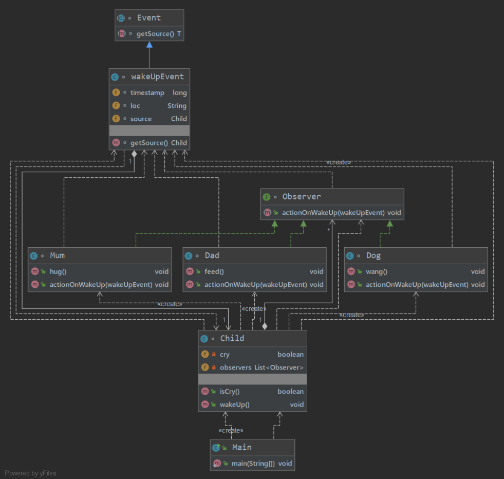

# Observer观察者模式

## 一、作用

在对某模块、功能发生某事件时，对其做出相应的处理。

## 二、实现

模拟场景：父母、宠物狗作为观察者，观察到孩子哭后，分别做相应的动作。

### 图中内容

- Clild ： 被观察的对象。

    聚合多个Observer。在被观察的动作( wakeUp() )发生时，依次调用Observer相应的方法。

- Observer ：观察者

- Mum、Dad、Dog ：具体的观察者对象。

- WakeUpEvent : 被观察者中的被观察的事件对象。

    包含事件的相应信息，以及被观察者本身。

- Event ：事件的基类

### 说明

WakeUpEvent 的作用

  1. 使观察者可==获取事件内容==来做不同的处理
  2. T getSource()。使观察者可==获取被观察者本身的内容==，以便根据被观察者做相应的处理。
  使得观察者作用与不同的被观察者（事件源对象）。

Event 的作用
  
   1. 作为WakeUpEvent事件的基类，以形成事件体系
