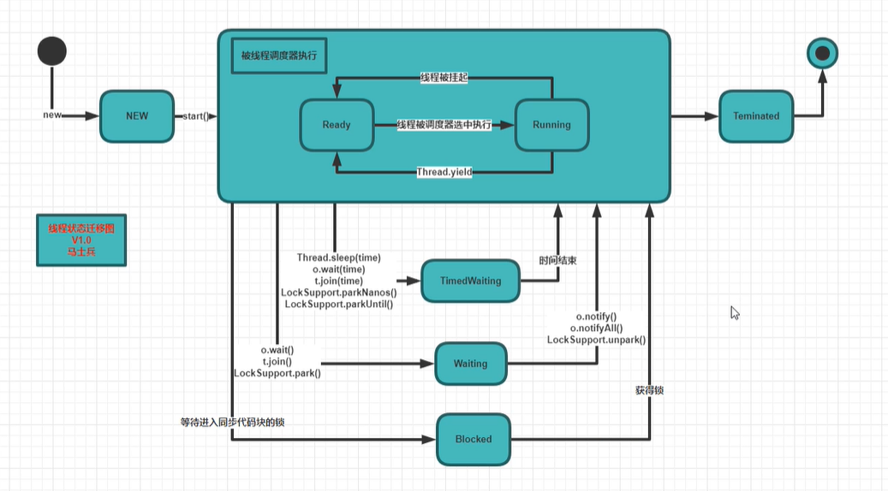

# State状态模式

## 一、作用

当一个类中的多个动作、方法需随着某状态的改变而变化时，使用。
适用于动作不再扩展

## 二、实现

当类中多个动作需随状态属性而改变时：

1. 将状态和动作结合同一个类中。
    每个动作都需要对状态进行判断，当状态添加时，动作也需要添加判断。类耦合度过高。

2. 使用State。
    将状态属性和相应的动作提取出来。状态作为一个接口（抽象类），接口中包含随状态变化的动作。
    每添加一个状态，则添加一个State接口的实现类。

```puml
    skinparam backgroundColor Beige

    class State{
        operation01();
        operation02();
        operation03();
    }

    Class XXState01{
        operation01();
        operation02();
        operation03();
    }

    Class XXState02{
        operation01();
        operation02();
        operation03();
    }

    Class XXState03{
        operation01();
        operation02();
        operation03();
    }
    XXState01 --|> State
    XXState02 --|> State
    XXState03 --|> State

```

- java中的线程状态（==有限状态机==）



其==不同于状态模式==,其动作的变化不仅是随状态而改变，而且需要随输入而改变。动作中，输入内容的不同会导致状态的不同，进而动作发生变化。
