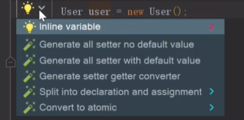
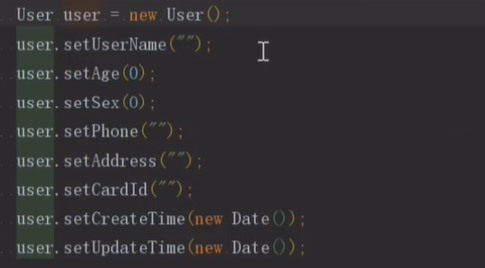

# IDEA插件

## 1、CodeGlance

在编译区显示代码全窗口


## 2、Mybatis plugin</font>

实现mapper接口与mapper的xml文件的跳转

## 3、Alibaba Java Coding Guidelines

阿里巴巴Java开发规约检测插件

## 4、RestfulToolKit


## 5、GsonFormat

```html

通过JSON生成相应的代码。

使用：alt + insert 选择 GsonFormat
```

<center class="half">
         
</center>

## 6、MyBatis Log Plugin

查看MyBatis中的SQL语句日志。


免费版本：[👉github开源](https://github.com/Link-Kou/intellij-mybaitslog)

## 7、GenerateAllSetter

一键生成所有set方法




## 8、SequenceDiagram

根据一个方法生成对应的时序图

## 9、Maven Helper

解决包冲突

## 10、 Easy Code

代码生成，支持自定义模板来生成代码

## 11、 IdeaVim

支持在Idea中使用Vim

