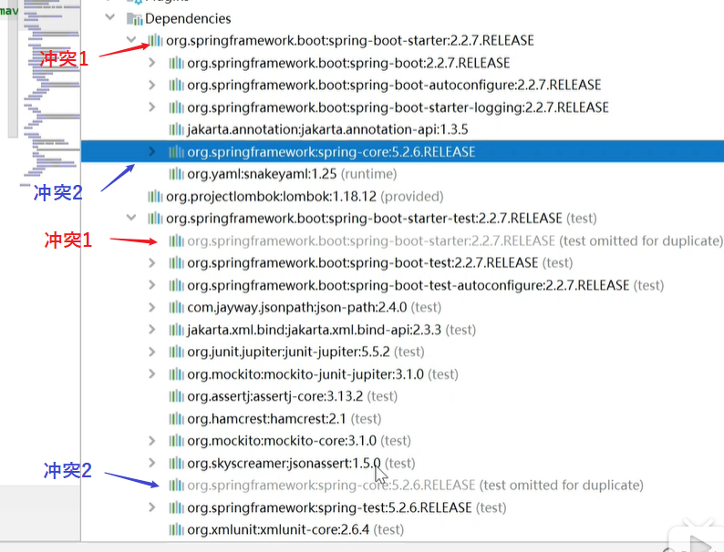

#

## 常用命令

1. mvn clean ： 清除
2. mvn compile : 编译
3. mvn test-compile : 编译测试程序
4. mvn test : 执行测试
5. mvn package : 打包
6. mvn install ： 安装
7. mvn site ：生成站点

## 基本概念

### 1. POM

Project Object Model
pom.xml 对于 Maven工程是核心配置文件

### 2. 坐标

groupid.artifactid.version

- groupid : 公司或组织域名倒序+项目名
- artifactid : 模块名称
- version : 版本号

### 3. 仓库

用于存储maven工程，包括第三方插件、jar包及个人Maven工程

- 中央仓库 ：位于当前电脑
- 本地仓库 ：服务于局域网或Internet

### 4. 依赖

此处依赖指的是项目中对jar包等的依赖

```xml
<dependency>
    <groupId></groupId>
    <artifactid></artifactid>
    <scope></scope>
</dependency>
```

#### 依赖范围(依赖的有效范围)

- complie  : 编译
- test     : 测试
- provied  : 不参与部署，有容器提供
（eg:servlet-api.jar）
  
|                | complie | test | provied |
|----------------|---------|------|---------|
| 对主程序有效   | ✔       | ✖    | -       |
| 对测试程序有效 | ✔       | ✔    | -       |
| 参与打包       | ✔       | ✖    | -       |
| 参与部署       | ✔       | -    | ✖       |
| 依赖传递       | ✔       | ✖    | ✖       |

#### 依赖排除

排除依赖中的部分子依赖内容

```xml
<dependency>
    <groupId> </groupId>
    <artifactid> </artifactid>
    <scope> </scope>
    <exclusions>
        <exclusion>
            <groupId> </groupId>
            <artifactid> </artifactid>
        </exclusion>
    </exclusions>
</dependency>
```

#### 依赖原则（解决maven依赖冲突）

1. 最短路径原则


2. pom文件中声明顺序优先


例如：



#### 冲突

以idea工具为例

🔹 方式一: 使用maven helper插件
使用该插件即可查看依赖冲突的内容,并自行选择排除冲突的内容

查看冲突内容


排除冲突


效果


🔹 方法二: 通过idea中的依赖图来查看并排除


### 5. 生命周期/插件/目标

#### 生命周期

定义项目构建环节的执行顺序
Maven中包含三个独立的生命周期：

1. Clean Lifecycle
    清理
2. Default Lifecycle
   编译、测试、打包、安装、部署等
3. Site Lifecycle
    生成项目报告，站点，发布站点。

&emsp;&emsp;在各个生命周期中，分别存在着多个阶段，阶段与阶段之间有着一定的执行顺序。且当执行指定的阶段时，会先从第一个阶段开始执行到指定的阶段，以实现自动化构建。
&emsp;&emsp;eg：当执行mvn package时，先自动执行前面的编译、测试等，再到执行打包。

> 构建环节：清理、编译、测试、报告、打包、安装、部署

#### 插件/目标

&emsp;&emsp;生命周期只是定义了执行的内容，真正执行则需要Maven插件来实现，而目标则指的是插件目标，可理解为调用插件的命令，相似的目标将由特定插件来完成。

### 6. 继承

当需要消除多个项目中的Maven依赖存在重复内容时，则可使用到Maven中的继承。
通过引入父模块来引用共用的内容来实现，内容的重复利用，统一管理。

1. 父模块pom.xml中使用\<dependencyManagement>标签来对统一管理依赖(该模块需为mave工程且打包方式为pom)

```xml
<groupId>com.xxx.xxx</groupId>
<artifactId>xxx</artifacID>
<version>xxx</version>
<packaging>pom</packaging>

<dependencyManagement>
    <dependencies>
        <dependency>
            <groupId>junit</groupId>
            <artifactId>junit</artifactId>
            <version>${junit.version}</version>
            <scope>test</scope>
        </dependency>
        <dependency>
            <groupId>cn.itcast.maven</groupId>
            <artifactId>HelloFriend</artifactId>
            <version>${maven.version}</version>
            <type>jar</type>
            <scope>compile</scope>
        </dependency>
    </dependencies>
</dependencyManagement>
```

2.子模块引用父模块

```xml
<parent>
    <groupId>com.xxx.xxx</groupId>
    <artifactId>xxx</artifacID>
    <version>xxx</version>
    <!-- 父模块中pom.xml 文件相对于当前文件的路径 -->
    <relativePath>../parent/pom.xml</relativePath>
</parent>

```

### 7. 聚合

可用于在父工程一键安装多个子模块工程

```xml

<modules>
    <!-- 各个子工程的相对路径 -->
    <module>../xx</module>
    <module></module>
    <module></module>
</modules>
```

<head>
    <script defer src="https://use.fontawesome.com/releases/v5.0.13/js/all.js"></script>
    <script defer src="https://use.fontawesome.com/releases/v5.0.13/js/v4-shims.js"></script>
</head>
<link rel="stylesheet" href="https://use.fontawesome.com/releases/v5.0.13/css/all.css">
