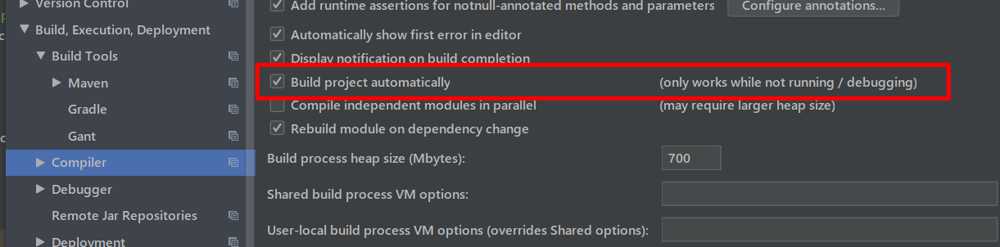
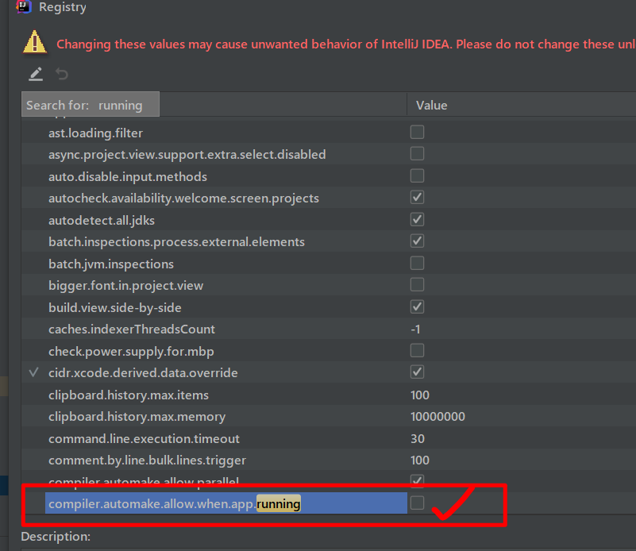

```xml
<dependencies>
    <dependency>
        <groupId> org.springframework.boot </groupId>
        <artifactId> spring-boot-devtools </artifactId>
        <optional> true </optional>
    </dependency>
</dependencies>
```



shift ctrl alt ?




## 页面debug

在页面代码添加debugger