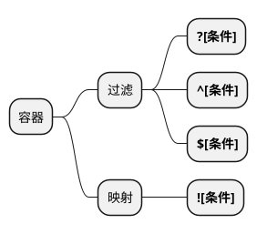

# SpEL

## 1. 简介

SpEL（Spring Expression Language）为Spring中的表达式语言。可用于属性的查询与操作，类似EL表达式。通过@Value与SPEL结合使用，可更灵活地为参数赋值。

## 2. 语法

### 2.1. 文字表达式与运算符

支持数值、字符串、日期等类型。
运算符支持算术、逻辑、关系运算符。
运算符也支持字符符号：
 lt (<), gt (>), le (<=), ge (>=), eq (==), ne (!=), div (/), mod (%), not (!)。

```java

    @Value("str1") // str1
    private String str;

    @Value("#{str2}") // str2
    private String str;

    @Value("#{1+3}")  // 4
    private Integer num;

    //其它案例：
    // 1000.00 - 1e4
    // "true and false"
```

### 2.2. 内联列表、内联map

用于对容器相关参数直接赋值。都是用{}来表示。

```java

    @Value("#{{'list_str1','list_str2'}}")
    private List<String> list;

    @Value("#{{'name':'name01','password':'password01'}}")
    private Map map;

```

### 2.3. 三元运算符与Elvis操作符

Elvis 操作符是用于简写判断null值的三元运算符，
eg：name!=null ? name : 'isNULL'  ==> name?:'isNULL'

```java

    @Value("#{xi.age>=18?'成年':'未成年'}")
    private String str5;

    @Value("#{xi.age==null?xi.age:'isNULL'}")
    private String str6;
    // 等价于
    @Value("#{xi.age?:'isNULL'}")
    private String str7;

```

### 2.4. 方法调用

在方法调用上，对于普通方法可直接调用，对于静态方法则通过T()来获取静态方法。T(静态类名).function

```java
    // 调用String中的方法
    @Value("#{'abc'.substring(2, 3)}")
    private String str3;
    // 调用ioc容器中类的方法
    @Value("#{demoClass.myFun('abcde')}")
    private String str4;
    // 调用静态方法
    @Value("#{T(java.lang.Math).PI}")
    private double pi;


```

### 2.5. 引用bean

对于bean的获取可以使用@符号来获取ioc容器中内容，也可省略。

```java
    // 调用ioc容器中类的属性
    @Value("#{@xi.age}")
    private String ageStr;

    // 调用ioc容器中类的属性
    @Value("#{xi.age}")
    private String ageStr;

     // 调用ioc容器中类的方法
    @Value("#{demoClass.myFun('abcde')}")
    private Strubg str4;
```

### 2.6. 容器过滤与映射

SPEL可通过<b>.?[条件]</b>来对容器进行简单的过滤，?[]将获取符合条件的所有结果。
若只需获取第一个结果或最后一个结果，则可使用<b>\^[]和\$[]</b>,其中\^[]获取第一个结果，$[]获取最后一个结果

对于容器的映射，则通过<b>![]</b>来实现



```java
    @Value("#{xi.friends.?[age<10]}")
    private List<MyUser> friends_;

    @Value("#{xi.friends.![name]}") //返回[name...]
    private List<String> names;
```

### 2.7. 正则表达式

通过mathces关键字来实现。 value mathces '模板'。

```java
   @Value("#{xi.email matches '[a-zA-Z0-9._%+-]+@[a-zA-Z0-9._%+-]+.com'}")
    private boolean isEmail;
```

---
📘参考：
[官方文档](https://docs.spring.io/spring/docs/4.2.x/spring-framework-reference/html/expressions.html)
[官方文档-中文版](http://itmyhome.com/spring/expressions.html)