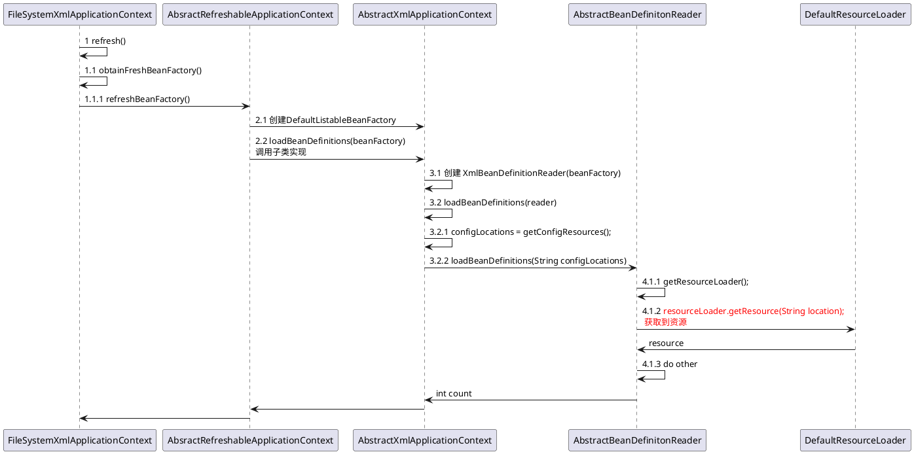

```puml
@startuml
FileSystemXmlApplicationContext -> FileSystemXmlApplicationContext :1 refresh()

FileSystemXmlApplicationContext -> FileSystemXmlApplicationContext :1.1 obtainFreshBeanFactory()

FileSystemXmlApplicationContext -> AbsractRefreshableApplicationContext: 1.1.1 refreshBeanFactory() 

AbsractRefreshableApplicationContext-> AbstractXmlApplicationContext: 2.1 创建DefaultListableBeanFactory

AbsractRefreshableApplicationContext-> AbstractXmlApplicationContext: 2.2 loadBeanDefinitions(beanFactory)    \n调用子类实现

AbstractXmlApplicationContext->AbstractXmlApplicationContext:3.1 创建 XmlBeanDefinitionReader(beanFactory)

AbstractXmlApplicationContext->AbstractXmlApplicationContext:3.2 loadBeanDefinitions(reader)

AbstractXmlApplicationContext->AbstractXmlApplicationContext:3.2.1 configLocations = getConfigResources();

AbstractXmlApplicationContext->AbstractBeanDefinitonReader: 3.2.2 loadBeanDefinitions(String configLocations)

AbstractBeanDefinitonReader->AbstractBeanDefinitonReader:4.1.1 getResourceLoader();

AbstractBeanDefinitonReader->DefaultResourceLoader:4.1.2 <font color=red>resourceLoader.getResource(String location);\n <font color=red>获取到资源

DefaultResourceLoader->AbstractBeanDefinitonReader :resource

AbstractBeanDefinitonReader->AbstractBeanDefinitonReader:4.1.3 do other

AbstractBeanDefinitonReader->AbstractXmlApplicationContext:int count

AbstractXmlApplicationContext->AbsractRefreshableApplicationContext

AbsractRefreshableApplicationContext->FileSystemXmlApplicationContext

@enduml

```