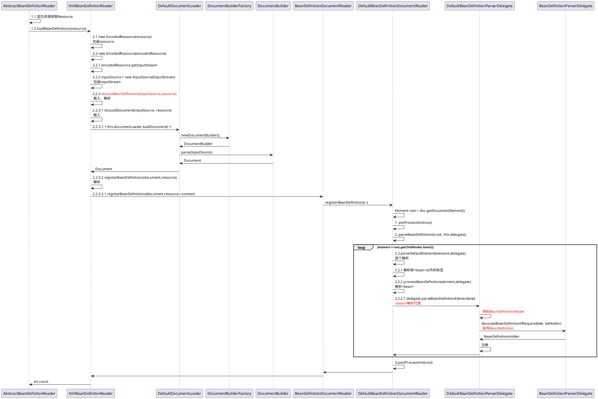
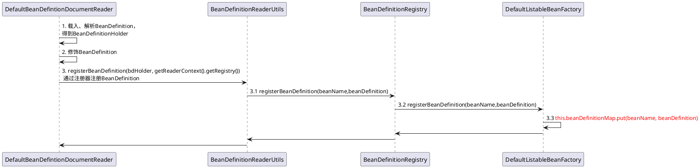

## Resource 定位

## Resource 载入

```puml
@startuml

AbstractBeanDefinitonReader->AbstractBeanDefinitonReader:1.1 定位资源获取Resource
AbstractBeanDefinitonReader->XmlBeanDefinitonReader: 1.2 loadBeanDefinitions(resource)
XmlBeanDefinitonReader->XmlBeanDefinitonReader: 2.1 new EncodedResource(resource) \n包装resource
XmlBeanDefinitonReader->XmlBeanDefinitonReader: 2.2 new EncodedResource(encodedResource) 

XmlBeanDefinitonReader->XmlBeanDefinitonReader: 2.2.1 encodedResource.getInputStream

XmlBeanDefinitonReader->XmlBeanDefinitonReader: 2.2.2 inputSource = new InputSource(InputStream)\n 包装inputStream

XmlBeanDefinitonReader->XmlBeanDefinitonReader: 2.2.3 <font color=red>doLoadBeanDefinitions(inputSource,resource) \n 载入、解析

XmlBeanDefinitonReader->XmlBeanDefinitonReader: 2.2.3.1 doLoadDocument(inputSource, resource) \n 载入


XmlBeanDefinitonReader->DefaultDocumentLoader: 2.2.3.1.1 this.documentLoader.loadDocument(~)

DefaultDocumentLoader ->DocumentBuilderFactory:newDocumentBuilder();

DocumentBuilderFactory->DefaultDocumentLoader :DocumentBuilder

DefaultDocumentLoader->DocumentBuilder:parse(inputSource)

DocumentBuilder->DefaultDocumentLoader:Document


DefaultDocumentLoader->XmlBeanDefinitonReader:Document

XmlBeanDefinitonReader->XmlBeanDefinitonReader: 2.2.3.2 registerBeanDefinitions(document,resource) \n 解析

XmlBeanDefinitonReader->BeanDefinitionDocumentReader:2.2.3.2.1 registerBeanDefinitions(document,resource->context)

BeanDefinitionDocumentReader->DefaultBeanDefinitionDocumentReader:registerBeanDefinitions(~)

DefaultBeanDefinitionDocumentReader->DefaultBeanDefinitionDocumentReader:Element root = doc.getDocumentElement();

DefaultBeanDefinitionDocumentReader->DefaultBeanDefinitionDocumentReader:1. preProcessXml(root)

DefaultBeanDefinitionDocumentReader->DefaultBeanDefinitionDocumentReader:2. parseBeanDefinitions(root, this.delegate);
loop element = root.getChildNodes.item(i)
    DefaultBeanDefinitionDocumentReader->DefaultBeanDefinitionDocumentReader: 2.2 parseDefaultElement(element,delegate)\n逐个解析

    DefaultBeanDefinitionDocumentReader->DefaultBeanDefinitionDocumentReader: 2.2.1 解析除<bean>以外的标签


    DefaultBeanDefinitionDocumentReader->DefaultBeanDefinitionDocumentReader: 2.2.2 processBeanDefinition(element,delegate)\n解析<bean>

    DefaultBeanDefinitionDocumentReader->DefaultBeanDefinitionParserDelegate: 2.2.2.1 delegate.parseBeanDefinitionElement(ele)\n<font color=red><bean>解析代理
    DefaultBeanDefinitionParserDelegate->DefaultBeanDefinitionParserDelegate:<font color=red> 得到BeanDefinitionHolder
    DefaultBeanDefinitionParserDelegate->BeanDefinitionParserDelegate:decorateBeanDefinitionIfRequired(ele, bdHolder)\n <font color=red>装饰BeanDefinition
    BeanDefinitionParserDelegate->DefaultBeanDefinitionParserDelegate:BeanDefinitionHolder
    DefaultBeanDefinitionParserDelegate->DefaultBeanDefinitionParserDelegate:注册
    DefaultBeanDefinitionParserDelegate->DefaultBeanDefinitionDocumentReader
end
DefaultBeanDefinitionDocumentReader->DefaultBeanDefinitionDocumentReader: 3.postProcessXml(root)


DefaultBeanDefinitionDocumentReader->BeanDefinitionDocumentReader
BeanDefinitionDocumentReader->XmlBeanDefinitonReader
XmlBeanDefinitonReader->AbstractBeanDefinitonReader:int count

@enduml

```

## BeanDefinition注册

```puml

@startuml

DefaultBeanDefintionDocumentReader->DefaultBeanDefintionDocumentReader:1. 载入、解析BeanDefinition，\n得到BeanDefinitionHolder

DefaultBeanDefintionDocumentReader->DefaultBeanDefintionDocumentReader: 2. 修饰BeanDefinition

DefaultBeanDefintionDocumentReader->BeanDefinitionReaderUtils: 3. registerBeanDefinition(bdHolder, getReaderContext().getRegistry())\n 通过注册器注册BeanDefinition

BeanDefinitionReaderUtils->BeanDefinitionRegistry:3.1 registerBeanDefinition(beanName,beanDefinition)

BeanDefinitionRegistry -> DefaultListableBeanFactory:3.2 registerBeanDefinition(beanName,beanDefinition)

DefaultListableBeanFactory->DefaultListableBeanFactory:3.3 <font color=red>this.beanDefinitionMap.put(beanName, beanDefinition)

DefaultListableBeanFactory->BeanDefinitionRegistry
BeanDefinitionRegistry->BeanDefinitionReaderUtils
BeanDefinitionReaderUtils->DefaultBeanDefintionDocumentReader

@enduml

```
