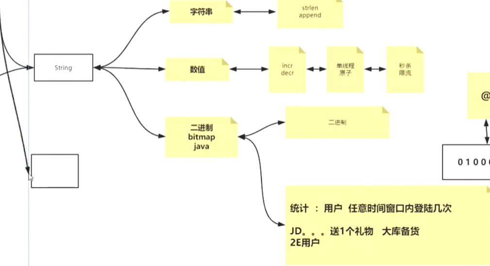
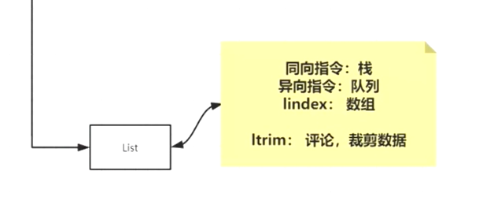
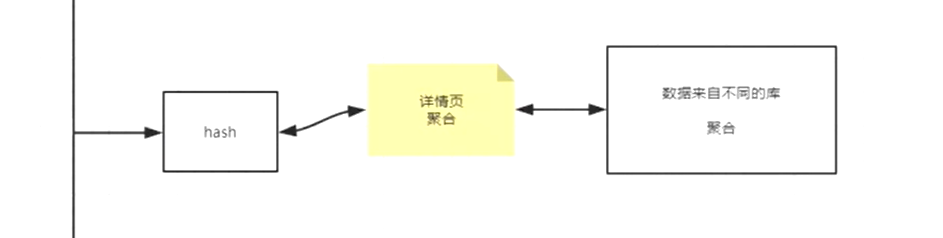
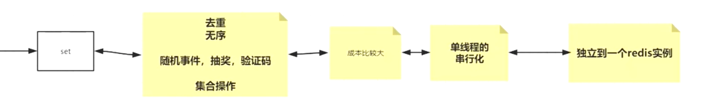
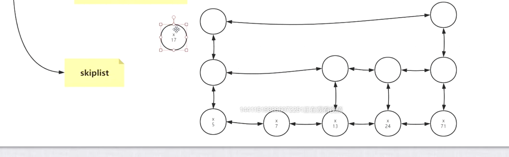
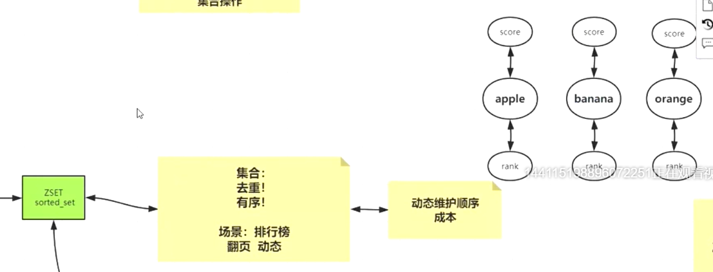

# 应用场景

## 1. string

### bitmap

setbit key 第几位 1/0
getbit key 第几位
bitcount key

redis为二进制安全
存入时,多少字节,则写入多少字节.取出也是该字节数.
假如存入GBK编码的一个中文字,为2个字节,以UTF8读取时,也是读出两个字节,并不是3个字节

## 2. list

## 3. hash

## 4. set

<!--  -->
## 5. zset

