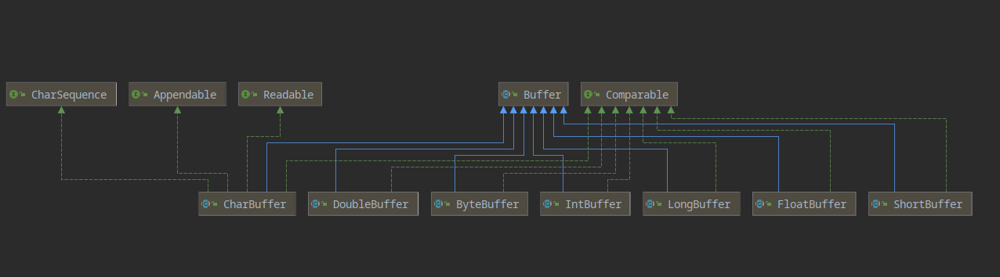

#

## 1.简介

NIO(non-blocking IO),为非阻塞IO，从JDK1.4开始推出。
其IO操作为同步非阻塞，不同于同步且阻塞的BIO，NIO通过事件驱动的方式实现一线程多客户端。

||BIO|NIO|
|-|-|-|
|处理数据的方式|数据流|缓存块Buffer|
|是否阻塞|是|否|
|线程连接数|一线程一客户端|一线程多客户端|

NIO图：
 [[TODO]]

## 2. 三大组件

NIO中有三个核心组件:
 
    Buffer缓冲区
    Channe通道
    Selector选择器

### 2.1. Buffer

    可以写入数据的内存块。相比数组，Buffer API更容易操作和管理

#### 2.1.1. 三个重要属性


Buffer缓存区通过capactity来表示其总容量（不可修改），通过position来表示当前读写的位置，
limit来标记当前可读写的最大位置，position与limit的间的差值作为当前读写可用的容量。

#### 2.1.2. 类结构及类方法

Buffer接口含存储各基本数据类型的子接口，除了Boolean类型


##### Buffer类下方法

```java
public final int capacity( )//返回此缓冲区的容量
public final int position( )//返回此缓冲区的位置
public final Buffer position (int newPositio)//设置此缓冲区的位置
public final int limit( )//返回此缓冲区的限制
public final Buffer limit (int newLimit)//设置此缓冲区的限制

public final Buffer clear( )//清除此缓冲区, 即将各个标记恢复到初始状态，但是数据并没有真正擦除, 后面操作会覆盖
public final Buffer flip( )//反转此缓冲区
public final Buffer rewind( )//重绕此缓冲区
public final int remaining( )//返回当前位置与限制之间的元素数
public final boolean hasRemaining( )//告知在当前位置和限制之间是否有元素
public abstract boolean isReadOnly( );//告知此缓冲区是否为只读缓冲区
public final Buffer mark( )//在此缓冲区的位置设置标记
public final Buffer reset( )//将此缓冲区的位置重置为以前标记的位置  

public abstract boolean hasArray();//告知此缓冲区是否具有可访问的底层实现数组
public abstract Object array();//返回此缓冲区的底层实现数组
public abstract int arrayOffset();//返回此缓冲区的底层实现数组中第一个缓冲区元素的偏移量
public abstract boolean isDirect();//告知此缓冲区是否为直接缓冲区
```

##### ByteBuffer类下方法

```java
//缓冲区创建相关api
public static ByteBuffer allocateDirect(int capacity)//创建直接缓冲区
public static ByteBuffer allocate(int capacity)//设置缓冲区的初始容量
public static ByteBuffer wrap(byte[] array)//把一个数组放到缓冲区中使用
//构造初始化位置offset和上界length的缓冲区
public static ByteBuffer wrap(byte[] array,int offset, int length)
    //缓存区存取相关API
public abstract byte get( );//从当前位置position上get，get之后，position会自动+1
public abstract byte get (int index);//从绝对位置get
public abstract ByteBuffer put (byte b);//从当前位置上添加，put之后，position会自动+1
public abstract ByteBuffer put (int index, byte b);//从绝对位置上put
```
