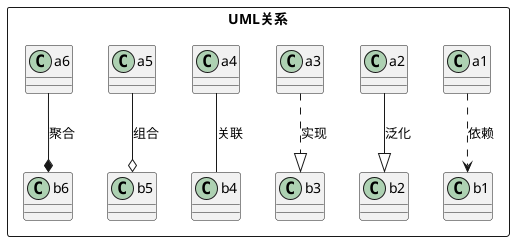
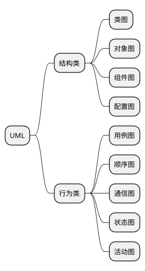

符号表格：

| 描述      | 符号类型                     | 符号                                                       | 指向               |
| --------- | ---------------------------- | ---------------------------------------------------------- | ------------------ |
| 关联      | 存在联系                     |  | 消息接收方         |
| 包含      | -                            |  | 分解出来的功能用例 |
| 扩展      | -                            |  | 基础用例           |
| 泛化/继承 | 父--子                       |  | 父用例             |
| 实现      |                              |  | 接口               |
| 依赖      |                              |  | 被依赖项           |
| 聚合      | 整体和部分--部分可单独存在   |  | 整体               |
| 组合      | 整体和部分--部分不能单独存在 |  | 整体赖项           |

