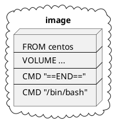
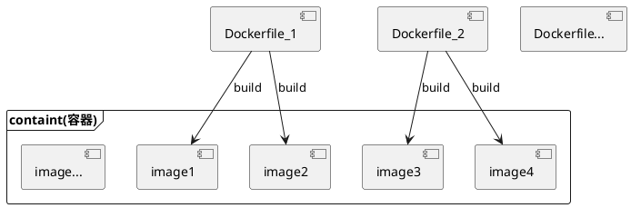

#

## 1. 什么是Dockerfile

Dockerfile是docker中用于创建镜像的构建文件。

## 2. 构建过程

🔹 使用 <b>docker build [参数] 路径</b>来创建

    -f : Dockerfile文件 (不指定时.默认为Dockerfile)
    -t : tag 生成的镜像文件名[:tag]

使用Dockerfile来创建镜像时,Dockerfile中的命令逐行运行,且Dockerfile中的每一个命令都作为镜像的一层。



```shell
# 使用Dockerfile创建镜像
docker build -f /home/docker-demo-volume/Dockerfile -t xi/centos:1.0 .

--------------输出内容（每一条命令为镜像中的一层）-----------------
Sending build context to Docker daemon  2.048kB
Step 1/4 : FROM centos                          // 镜像中的一层
 ---> 470671670cac
Step 2/4 : VOLUME ["volume01","volume02"]       // 镜像中的一层
 ---> Running in 77c7856b6bd7
Removing intermediate container 77c7856b6bd7
 ---> 2de9fb538af5
Step 3/4 : CMD "==END=="                        // 镜像中的一层
 ---> Running in 78ae62e1984a
Removing intermediate container 78ae62e1984a
 ---> 72e2c6602a30
Step 4/4 : CMD "/bin/bash"                      // 镜像中的一层
 ---> Running in 4a98993afbac
Removing intermediate container 4a98993afbac
 ---> d00e4595f1ae
Successfully built d00e4595f1ae
Successfully tagged xi/centos:1.0

---------------------------End--------------------------------

```

通过Dockerfile文件可创建1~n个镜像, 1~n个镜像运行后则组成一个容器



### 3. 指令

#### 3.1. 常用指令

|指令|作用|说明|
|-|-|-|
|FROM | 指定基础镜像||
|MAINRAINER | 维护者、作者信息 |姓名<邮箱> |
|RUN| 构建时,所执行的内容 ||
|ADD| 用于添加其它镜像 |ADD tar.gz压缩包 解压路径|
|WORKDIR| 该镜像的工作目录 ||
|VOLUME| 挂载的目录 ||
|EXPOST | 端口配置 ||
|CMD|启动时,执行的内容 ( 只有最后一个命令生效 )--命令替换||
|ENTRYPOINT|启动时,所执行的内容( 命令都生效 ) -- 命令追加||
|ONBUILD|在镜像构建后,执行的命令||
|COPY|将文件复制到该镜像中,类似ADD|COPY 文件 镜像内文件 |
|ENV|设置环境变量|ENV KEY VALUE|

#### 3.2. 案例

1️⃣ 修改CentOS镜像

docker中CentOS为阉割版,去除了运行所不必要的内容,默认工作目录为根目录.
该案例在这基础上,给其添加ifconfig、vim指令和指定工作目录.

```shell

# 1. 编写Dockerfile
vi Dockerfile_centos
--------------------Dockerfile_centos内容-----------------------
FROM centos                         # 指定centos为基础镜像
MAINTAINER Jianxi<123456@qq.com>    # 指定维护者信息

ENV MYPATH /usr/local               # 添加环境参数
WORKDIR $MYPATH                     # 指定工作目录 $参数名-获取环境参数

RUN yum -y install vim              # 镜像创建时,安装vim
RUN yum -y install net-tools        # 镜像创建时,安装网络操作命令,含ifconfig

EXPOSE 80                           # 指定该镜像对外开放端口80

CMD echo $MYPATH                    # 镜像启动时,执行该命令,输出MYPATH参数的值
CMD echo "----End-----"
CMD /bin/bash
------------------------------End--------------------------------

# 2. 创建镜像
docker build -f Dockerfile_centos -t mycentos:1.0 .

# 3. 测试
#  启动镜像
docker run -it 3ff53fe7bd05
#  检查工作路径
pwd                         # 输出 /usr/local
#  检查ifconfig与vim是否存在、可用
ifconfig                    # 可用
vim -version                # 可用

```

2️⃣ 创建Tomcat镜像

以centos为基础,配置tomcat以及jdk环境.并且将tomcat项目部署文件夹和日志文件夹挂载到主机上.

```shell

# 1.编写Dockerfile_tomcat文件
vi Dockerfile_tomcat
-----------------------------Dockerfile_tomcat内容-----------------------------
FROM centos
MAINTAINER xi<123456@qq.com>

COPY readme.txt /usr/local/readme.txt

ADD jdk-8u251-linux-x64.tar.gz /usr/local
ADD apache-tomcat-8.5.56.tar.gz /usr/local

RUN yum -y install vim

ENV MYPATH /usr/local
WORKDIR $MYPATH

ENV JAVA_HOME /usr/local/jdk1.8.0_251
ENV CLASSPATH $JAVA_HOME/lib/dt.jar;$JAVA_HOME/lib/tools.jar
ENV CATALINA_HOME /usr/local/apache-tomcat-8.5.56
ENV CATALINA_BASH /usr/local/apache-tomcat-8.5.56
ENV PATH $PATH:$JAVA_HOME/bin;$CATALINA_HOME/lib;$CATLINA_HOME/bin

EXPOSE 8080

CMD /usr/local/apache-tomcat-8.5.56/bin/startup.sh \
&& tail -F /usr/local/apache-tomcat-8.5.56/bin/logs/catalina.out 

--------------------------------------End-----------------------------------

# 2. 创建镜像
docker build -f Dockerfile_tomcat -t mytomcat:1.0 .

# 3. 启动该镜像的容器并挂载目录
docker run -d -p 9090:8080 --name xitomcat \
-v /home/docker_demo_volume/tomcat/testproject:/usr/local/apache-tomcat-8.5.56/webapps/test \
-v /home/docker_demo_volume/tomcat/logs:/usr/local/apache-tomcat-8.5.56/logs \
mytomcat:1.0

# 4. 测试,访问地址ip:9090  #显示tomcat页面

# 5. 在主机被挂载的目录上添加web.xml和index.jsp.
#    测试挂载目录是否有效
docker exec -it 37c468f8eed9 /bin/bash

cd /home/docker_demo_volume/tomcat/testproject
mkdir MEB-INF && cd MEB-INF && vim web.xml
------------------------------web.xml--------------------------------
<?xml version="1.0" encoding="UTF-8"?>
<web-app xmlns="http://java.sun.com/xml/ns/javaee"
   xmlns:xsi="http://www.w3.org/2001/XMLSchema-instance"
   xsi:schemaLocation="http://java.sun.com/xml/ns/javaee http://java.sun.com/xml/ns/javaee/web-app_2_5.xsd"
   version="2.5">
   ...
</web-app>
-------------------------------End-----------------------------------

cd ../
vim index.jsp

------------------------------index.jsp------------------------------
<!DOCTYPE html>
<html>
    <head>
        <meta charset="UTF-8" />
        <title>docker tomcat</title>
    </head>
    <body>
        <%= new String("Hello!") %>
    </body>
</html>
-------------------------------End---------------------------
---

# 6. 测试,访问地址ip:9090/test  #显示Hello!

```

#### 3.3. docker history命令

语法: <b>docker history 镜像ID</b>
作用: 查看该镜像创建时,指令执行的历史记录.
