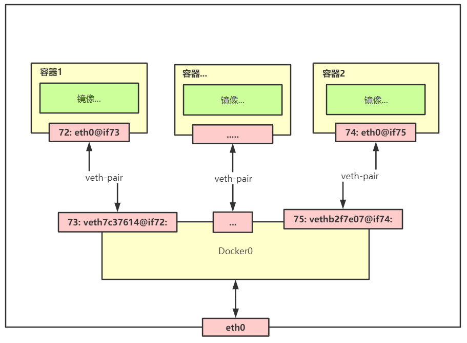

#

## 1.docker网络模型

docker容器是通过veth-pair来实现容器间的通信,使用桥接模式来实现.docker启动后,主机便有一个名为docker0的网卡,其将作为容器通信的桥梁.docker0通过veth-pair来
与容器虚拟网络通信,再与主机的eth0网卡通信,以此实现容器的通信.


## 2. 容器通信

容器间的通信,需要docker0来进行转发.为此,使用veth-pair连接后,docker会给容器分配一个ip.

### 💭 问题一 : ip值不稳定

使用ip来请求容器内容时,当容器被分配的ip发生改变,请求url也需改变,如何解决这一问题?

#### 解决方法 : 使用--link

对于该问题,docker可使用容器名称来与容器ip进行映射,外部引用只需使用容器名称,无需使用ip.
🔹 命令: <b>docker run --link 容器名称</b>

使用--link后,将在容器内的/etc/hosts文件中添加link容器ip与link容器名称映射的内容.

案例:

```shell
# 1. 启动tomcat01容器,并添加tomcat02容器ip与其名称的映射
docker run -d --name tomcat01 --link tomcat02 tomcat
# 检查tomcat01容器中的hosts
docker exec -it tomcat01 cat /etc/hosts
---------tomcat01容器的/etc/hosts----------------
172.18.0.3	tomcat02 3e7188ad5609
172.18.0.2	5ec20623eeec
------------------------------------------------

# 2. 容器tomcat01 ping 容器tomcat02(172.18.0.3)
docker exec -it tomcat01 ping 172.18.0.3
# 等价于
docker exec -it tomcat01 ping tomcat02

```

### 💭 问题二 : --link使用存在局限

--link 一次只能设置两个容器间单向通信的容器名与ip的映射.

#### 解决方法 : 自定义网络

使用docker自定义的网络,将会自动维护容器与容器被分配的ip的关系.弥补了docker0的局限性(默认无法通过容器名称进行通信).

#### 相关命令

🔹<b>docker network</b>

    ls          : 查看docker网络列表
    inspect     : 查看元数据
    rm          : 删除docker网络
    create      : 创建docker网络

🔹<b>docker run -net 网络模式 </b>

指定容器的网络模式,不指定时,默认为bridge

```shell
docker run -d -P -net bridge tomcat
# 等价于
docker run -d -P tomcat
```

>docker中的网络模式
&emsp;bridge  : 桥接模式 (默认)
&emsp;none    : 不配置网络
&emsp;host    : 与宿主机共享网络
&emsp;container  : 连通容器网络 (局限大)

#### 创建自定义docker网络取代--link

```shell
# 自定义网络
# --driver  网络模式
# --subnet  子网
# --gateway  网关
docker network create --driver bridge \
--subnet 192.168.0.0/16 \
--gateway 192.168.0.1 mynet

# 测试:创建两个容器使用该自定义网络
docker run -d --name tomcat_net_1 --net mynet tomcat
docker run -d --name tomcat_net_2 --net mynet tomcat

# tomcat_net_1 ping tomcat_net_2 (无需使用ip)
docker exec tomcat_net_1 ping tomcat_net_2 #可ping通

```

## 3. 自定义网络

通过docker来自定义网络可用于取代--link来实现容器名称与其id的映射,如第2点所提及的内容.
同时使用自定义网络也可使不同集群的网络分离,保证集群的安全与健康.

#### 💭 当使用不同集群使用不同网络后,不同网络间又如何通信

不同网络为不同网段,网卡之间无法在直接连通.但对于集群网络中的容器而言,容器可添加到不同的网络,也就是一个容器可有两个ip,可实现容器与另一个网段网络的连通.

#### 相关命令

<b>docker network connect 网络 容器</b>
将一个容器加入到网络中

#### 实现不同网段间通信

```shell
# 将docker0网卡下的容器 添加到自定义网卡mynet
# 实现该容器到mynet网络的通信
docker network connect mynet tomcat_1

# 网卡docker0下的tomcat_1 ping 网卡mynet下的tomcat_net_1
docker exec -it tomcat_1 ping tomcat_net_1      #可ping通

```
