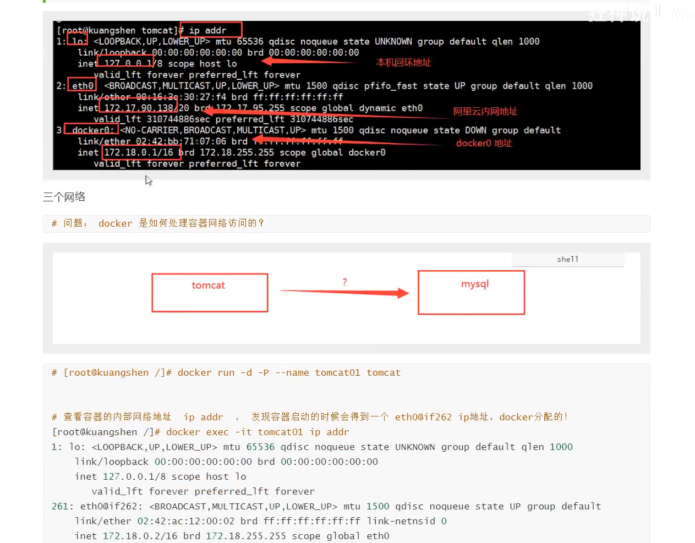
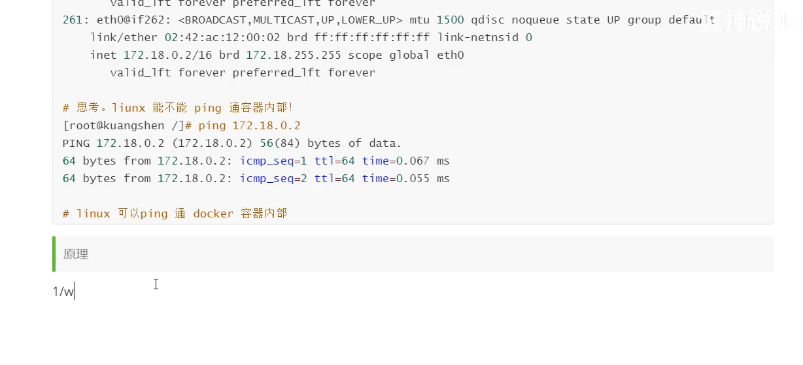
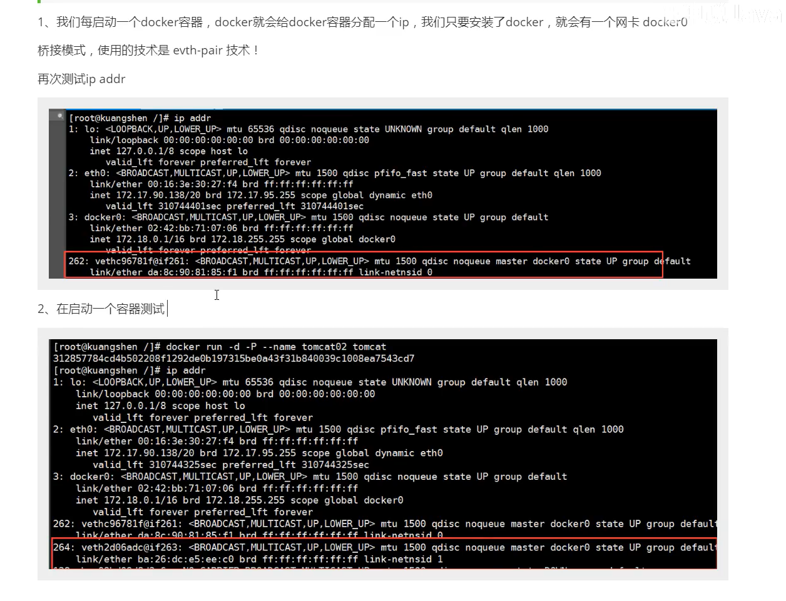
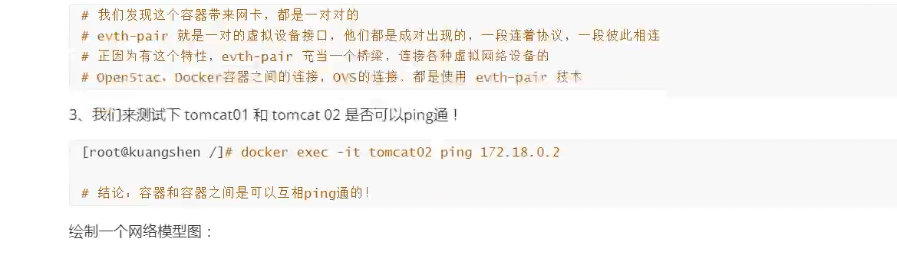
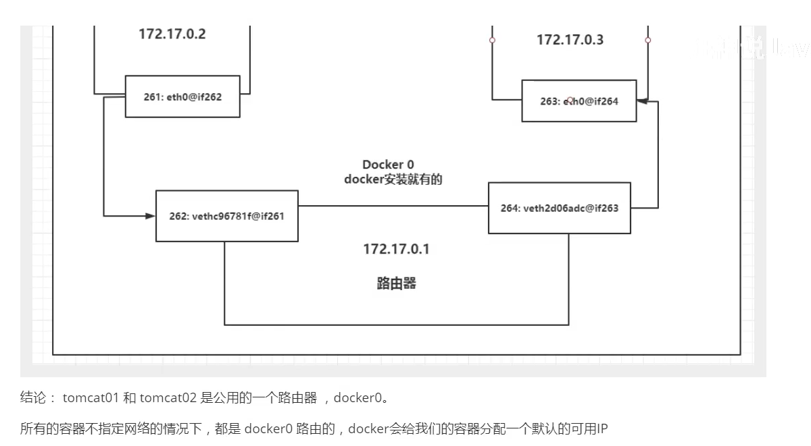
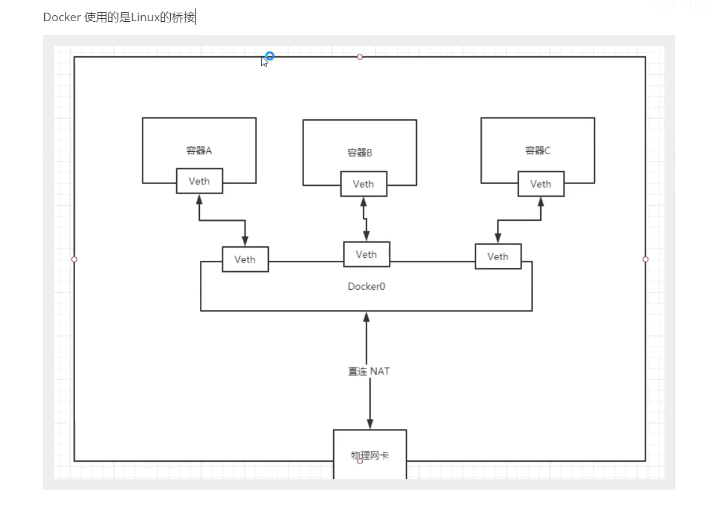
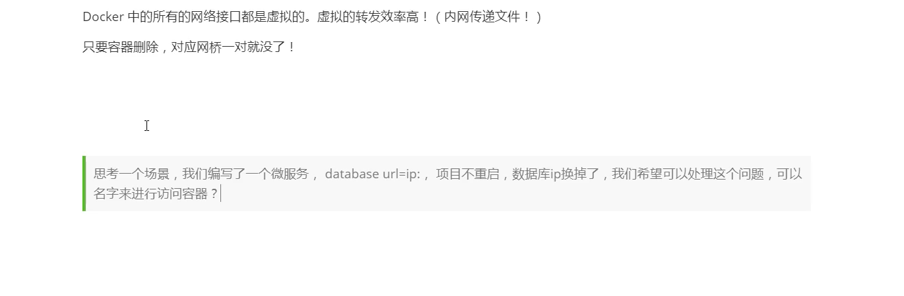
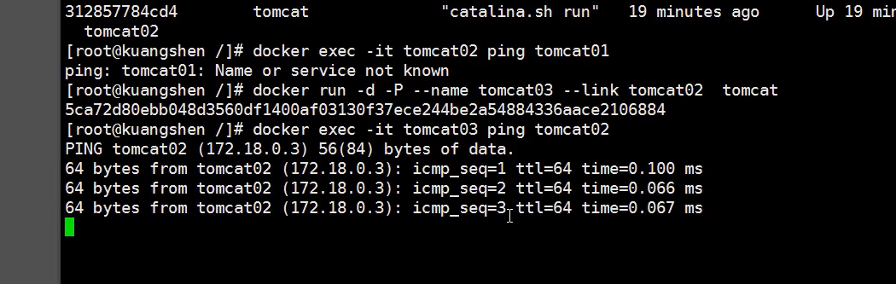
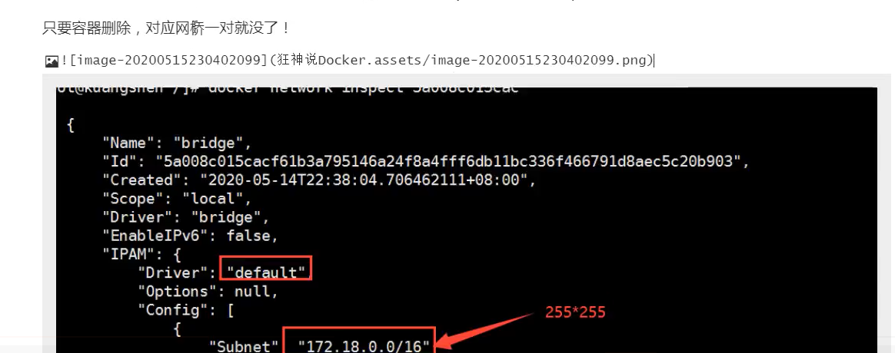
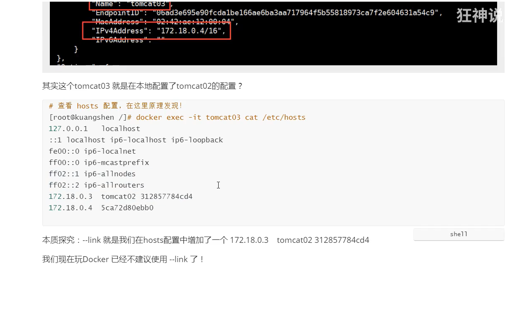

linux与docker容器网络在同一个网段



!














## Linux网络-命名空间

### 相关命令

🔹 <b>ip netns</b>

    list    : 显示命名空间列表
    delete  : 删除命名空间
    add     : 添加命名空间

案例:
```shell
ip netns list               [[查看namespaces]]
ip netns add test1          [[添加名为test1的namespaces]]
ip netns delete test1       [[删除名为test1的namespaces]]
```

🔹<b>ip link</b>

set : 设置网络信息
add : 添加网络设置

```shell
ip link set dev lo up
ip link add veth-test1 type with peer name veth-test2
ip link set veth-test1 netns test1
```

### 命名空间间的通信

namaspaces之间是相互独立,互不影响.若要实现namespace之间网络通信,则需要借助veth-pair虚拟设备接口来连接namespace,实现通信.

🔹 测试通过veth-pair实现两个namespace的通信

```shell

# 添加命名空间 test01 与 test02
ip netns add test01
ip netns add test02

ip link add veth-test1 type veth peer name veth-test2
ip link set veth-test1 netns test01
ip link set veth-test2 netns test02


ip netns exec test01 ip addr add 192.168.1.1/24 dev veth-test1
ip netns exec test02 ip addr add 192.168.1.2/24 dev veth-test2

ip netns exec test01 ip link set dev lo up
ip netns exec test01 ip a
ip netns exec test02 ip link set dev lo up
ip netns exec test02 ip a


ip netns exec test01 ip a
ip netns exec test02 ip a

ip netns exec test01 ping 192.168.1.2

```


---
相关文章:
[Net Namespace 下的网络通信](https://hansedong.github.io/2018/12/21/12/)
[veth pair](https://blog.csdn.net/sld880311/article/details/77650937)
[veth pair](https://www.cnblogs.com/bakari/p/10613710.html)
