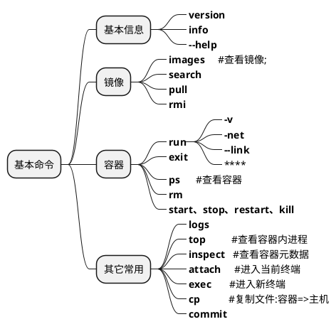
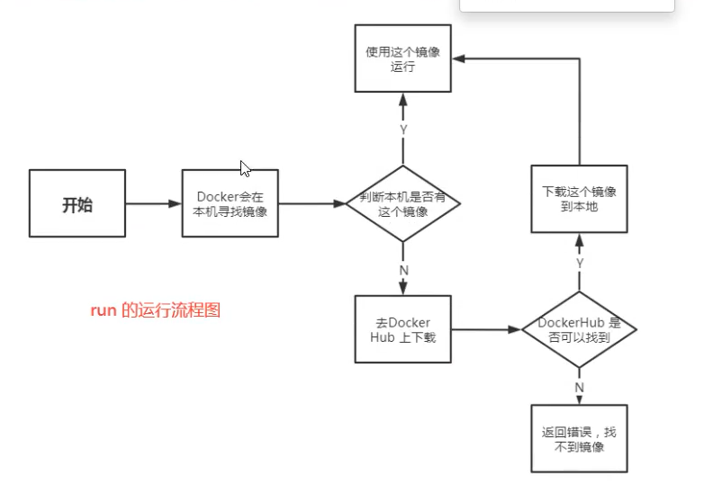

> 记录docker的基本命令，包括镜像、容器相关命令以及其它常用命令。




> 补充：
> 启动docker : systemctl start docker
> dockerHub : <https://hub.docker.com/>

## 1. 信息

🔹 <b>查看版本</b>

<b>docker version</b>

🔹 <b>查看信息</b>

<b>docker info</b>

🔹 <b>帮助信息</b>

<b>docker --help</b>

🔹 <b>状态信息</b>

<b>docker stats 容器id</b>



## 2. 镜像

🔹 <b>查看所有</b>

<b>docker images</b>

    -a : 显示所有
    -q : 只显示id
    -f : 过滤

```shell
docker images -aq
```

🔹 <b>搜索</b>

<b>docker search 关键字</b>

    --filter : 过滤

```shell
docker search mysql --filter=STARS=3000
```

🔹 <b>下载</b>

<b>docker pull 镜像名称[:tag]</b>

```shell
docker pull mysql:5.7
```

描述信息：

```shell
//分层下载，已存在则不重复下载
5.7: Pulling from library/mysql
8559a31e96f4: Already exists
d51ce1c2e575: Already exists
....
f7a5433ce20d: Pull complete
3dcd2a278b4a: Pull complete
//签名
Digest: sha256:32f9d9a069f7a735e28fd44ea....
Status: Downloaded newer image for mysql:5.7
//实际地址
docker.io/library/mysql:5.7

```

🔹 <b>删除</b>

<b>docker rmi [镜像名称...|ID...]</b>

    -f,--Force : 强制删除

```shell
docker rmi -f 9cfcce23593a
# 删除所有镜像
docker rmi -f $(docker images -aq)
```

## 3. 容器

🔹 <b>启动</b>

<b>docker run [参数] 镜像ID|镜像名称[:TAG]</b>

    --name="" : 容器名称
    -d        : 以后台的方式启动
    -it       : 交互方式运行（启动容器后进入容器操作）
    -p        : 指定端口
        -p ip:主机端口:容器端口
        -p 主机端口:容器端口
        -p 容器端口
    -P        : 随机端口

```shell
docker run -it centos /bin/bash
# --rm 用于测试，关闭即删除，docker ps 无记录
docker run -it --rm centos /bin/bash
```
> 注意：
> 当centos镜像没有运行内容时，容器即使是后台启动，也会被停止。
> netty也是一样。
>

🔹 <b>退出|停止</b>

<b>exit</b>
该命令将退出容器界面同时停止容器

<b>快捷键：Ctrl+p+q </b>
仅退出容器不停止容器

🔹 <b>查看</b>

<b>docker ps</b>

    -a : 查看所有（包含历史启动）
    -n=? : 显示最近的容器,eg:-n=1
    -q : 只显示编号

```shell
docker ps -a
```

🔹 <b>删除</b>

<b>docker rm</b>

    -f : 强制删除

```shell
//删除指定的容器
docker rm 容器id
//删除所有容器
docker rm -f $(docker ps -aq)
docker ps -aq | xargs docker rm -f
```

🔹 <b>启动、重启、停止、杀死</b>

<b>docker start 容器id</b>
<b>docker stop 容器id</b>
<b>docker restart 容器id</b>
<b>docker kill 容器id</b>

## 4. 常用命令

🔹 <b>提交</b>

<b>docker commit 容器id 目标镜像名[:TAG]</b>

    -m  ：提交说明信息
    -a  : 作者名称

```shell
docker commit -m "update tomcat" -a "xi" e4e7c5efc101 my_tomcat:1.0

//查询提交结果
[root@iZuf6505h9bgsfqqmhomj6Z /]# docker images
REPOSITORY            TAG                 IMAGE ID            CREATED             SIZE
my_tomcat             1.0                 398a9379c1db        54 seconds ago      652MB

```

🔹 <b>查看日志</b>

<b>docker logs 容器id</b>

    -t : 时间戳
    -f : 
    --tail : 显示的数量

```shell
docker logs -tf --tail 10
```

测试：

```shell
docker run -d centos /bin/sh -c "while true;do echo demo_docker;sleep 1;done"

docker logs -tf --tail 10 99a271fc5dc5
```

🔹 <b>查看进程信息</b>

<b>docker top 容器id</b>

```shell
docker top 99a271fc5dc5
```

🔹 <b>查看容器基本信息--元数据</b>

<b>docker inspect 容器id</b>

```shell
docker inspect 99a271fc5dc5
```

🔹 <b>进入正在运行的容器</b>

<b>方式一：docker exec 容器id</b>

    -it 交互式运行

```shell
docker exec -it 99a271fc5dc5 /bin/bash
```

<b>方式二：docker attach 容器id</b>

```shell
docker attach 99a271fc5dc5
```

> exec : 开启新终端
> attach : 进入正在执行的终端

🔹 <b>copy文件——从容器到主机</b>

<b>docker cp 容器id:容器内路径 主机路径</b>

```shell
// 将容器中/test.c 文件复制到 主机的/test.c
docker cp 48948a693704:test.c /test.c
```

🔹 给镜像添加tag

<b>docker tag 镜像id 镜像名称:tag</b>
