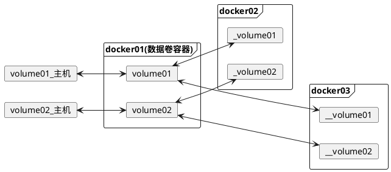
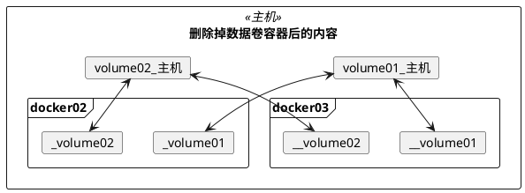
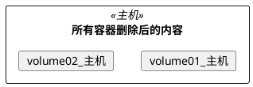

#

## 1. 什么是容器数据卷

docker中实现数据持久化的方案。将容器内的文件关联到主机（宿主机）的文件，可实现容器数据持久化与同步操作以及共享数据。

## 2. 基本使用（实现文件映射--挂载）

### 2.1. 方式一：使用run命令 -v

<b>docker run -it -v 主机目录:容器目录 容器名</b>

将容器目录映射到主机目录后，容器目录将与主机目录进行同步操作，以此实现数据同步。同时主机目录内容修改，容器内容也将发生修改，实现了双向绑定。

```shell
// 设置容器的映射文件
docker run -it -v /home/test:/home centos /bin/bash
// 查看映射信息
docker inspect 22b642f532bb

// inspect中的映射文件配置
 "Mounts": [
            {
                "Type": "bind",
                "Source": "/home/test", //主机目录
                "Destination": "/home", //docker容器目录
                "Mode": "",
                "RW": true,
                "Propagation": "rprivate"
            }
        ],

```

#### 案例（部署mysql）

```shell

# 1.下载mysql
docker pull mysql:5.7

# 2.启动、配置mysql
#   - 映射端口
#   - 映射文件
#   - 设置密码
docker run -d -p 3310:3306 \
-v /home/mysql/conf:/etc/mysql/conf.d \
-v /home/mysql/data:/var/lib/mysql \
-e MYSQL_ROOT_PASSWORD=123456 \
--name mysql01 mysql:5.7

# 3.测试：
# 远程连接并创建数据库
# 主机/home。mysql/data也会生成现有的数据库文件

# 4.删除docker中的数据库容器，主机中的数据库数据仍会存在
docker rm -f fb84a9afc5f3

```

### 2.2. 方式二：使用DockerFile

在文件中VOLUME 将指定该容器中将挂载的路径，若路径不存在则会自动创建。若只写容器挂载的路径，则为匿名挂载。

```shell
# 1.编写Dockerfile
vi Dockerfile
-----------Dockerfile内容------------
FROM centos
VOLUME ["volume01","volume02"]
CMD echo "--END--"
CMD /bin.bash
-----------------End------------------

# 2.创建镜像
docker build -f /home/docker-demo-volume/dockerfile -t xi/centos:1.0 .

# 3.运行镜像并进入
docker run -it d00e4595f1ae /bin/bash

# 4.查看/volume01与/volume02是否存在
ls
--------------------显示的内容-------------------------
bin  dev  ......  tmp  usr  var  volume01 volume02
------------------------End---------------------------

```

## 3. 数据卷命令 volume

<b>docker volume </b>

    create      Create a volume
    inspect     Display detailed information on one or more volumes
    ls          List volumes
    prune       Remove all unused local volumes
    rm          Remove one or more volumes

```shell
docker volume ls
docker volume inspect 卷名称
```

## 4. 具名挂载和匿名挂载

具名挂载：指定挂载的卷的名称
匿名挂载：不指定名称，随机生成卷名称

🔹 使用<b>docker run -v</b>来实现

匿名挂载：-v 容器路径
具名挂载：-v 卷名:容器路径
指定挂载路径： -v 主机路径:容器路径

> 设置容器对卷的权限
> -v 主机路径|卷名 : 容器路径 : ro|rw
> &emsp;ro : read only
> &emsp;rw : read and write

```shell

# 1. 匿名挂载nginx文件
docker run -d -P --name nginx01 -v /etc/nginx nginx
# 查看卷信息
docker volume inspect 3780b7c7663441ad015ac22235d7522175c
5ceeb02c05433df42b263f8aa4535

# 2. 具名挂载nginx文件
docker run -d -P --name nginx02 -v nginx-v:/etc/nginx nginx
# 查看卷信息
docker volume inspect nginx-v

[
    {
        "CreatedAt": "2020-06-14T00:38:57+08:00",
        "Driver": "local",
        "Labels": null,
        "Mountpoint": "/var/lib/docker/volumes/nginx-v/_data",
        "Name": "nginx-v",
        "Options": null,
        "Scope": "local"
    }
]

```

由volume inspect可看出，当不指定主机路径时，默认挂载的目录为/var/lib/docker/volumes/与卷名同名的文件夹/_data

## 5. 数据卷容器

当某个容器存在文件被多个容器挂载时。该容器则为父容器，也就为数据卷容器。以此实现多个容器之间的数据共享。

🔹 使用 <b>docker run --volumes-from </b>来实现

--volume-from 挂载的容器名

🔹 案例：
&emsp;实现docker01作为数据卷容器，docker02、docker03挂载到其中。

```shell

# 开启dockers01
docker run -it --name docker01 d00e4595f1ae /bin/bash

# 启动docker02，并挂载到dockers01容器
docker run -it --name docker02 --volumes-from docker01 /bin/bash

# 启动docker03，并挂载到docker01容器
docker run -it --name docker03 --volumes-from docker01 /bin/bash

```
> 以下图片中的volume01_主机、volume01、_volume01、__volume01文件夹名称都为volume01,这里为了区分,而显示不同名称. volume02也是一样.



当删除数据卷容器后，其子容器挂载在父容器的内容仍存在。
当所有容器都删除、关闭后，由于docker01数据卷容器在启动时，挂载了主机，所以卷内容在主机仍有保留。




