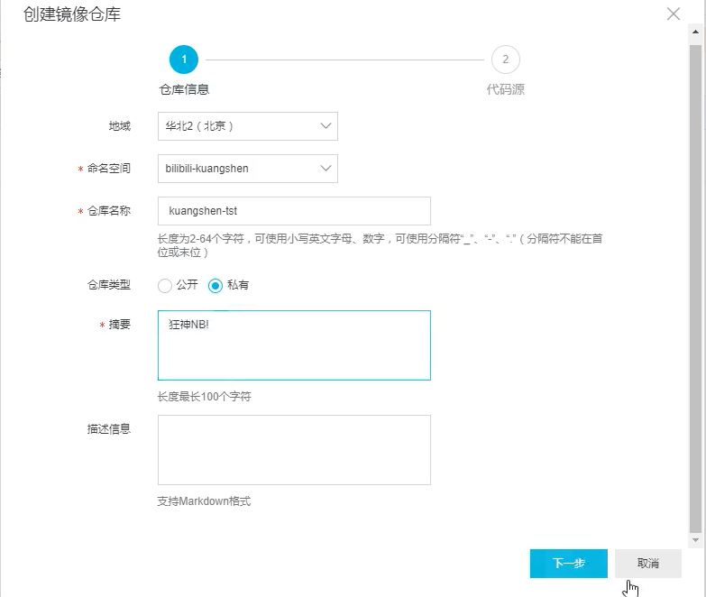
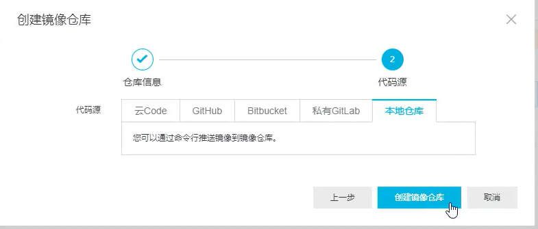

## 1. 安装

1️⃣ 检查环境

```shell
 cat /etc/os-release
```

> 环境：CentOS7

2️⃣ 下载相应的安装包以及设置仓库

```shell

yum install -y yum-utils

yum-config-manager \
    --add-repo \
    https://download.docker.com/linux/centos/docker-ce.repo

```

3️⃣ 更新yum软件包索引

```shell
yum makecache fast
```

3️⃣ 安装最新版

```shell
sudo yum install docker-ce docker-ce-cli containerd.io
```

## 2. 使用阿里云镜像加速

```shell
sudo mkdir -p /etc/docker
sudo tee /etc/docker/daemon.json <<-'EOF'
{
  "registry-mirrors": ["https://a2cjle0o.mirror.aliyuncs.com"]
}
EOF
sudo systemctl daemon-reload
sudo systemctl restart docker
```

[👉阿里云文档](https://cr.console.aliyun.com/cn-hangzhou/instances/mirrors)

## 3. 工具

## 3.1. portainer

portainer为docker的以图形化界面形式的管理工具

🔹 docker内安装

```shell
// docker内下载并启动
docker run -d -p 8088:9000 \
--restart=always -v /var/run/docker.sock:/var/run/docker.sock \
--privileged=true portainer/portainer
```

🔹 运行
打开 http://ip:8088

## 4. 发布个人镜像

### 4.1. 发布到DockerHub

1️⃣ 登录账号

使用命令:<b>docker login</b>

    -u : username
    -p : password

2️⃣ push镜像

使用命令:<b>docker push</b>

<b>docker push 用户名/镜像名称:tag</b>

#### 4.2. 发布到阿里云镜像

1️⃣ 在阿里云中创建命名空间
[👉阿里云命名空间](https://cr.console.aliyun.com/cn-shanghai/instances/namespaces)

2️⃣ 在阿里云中创建镜像仓库
[👉阿里云镜像仓库](https://cr.console.aliyun.com/cn-shanghai/instances/repositories)




3️⃣ 