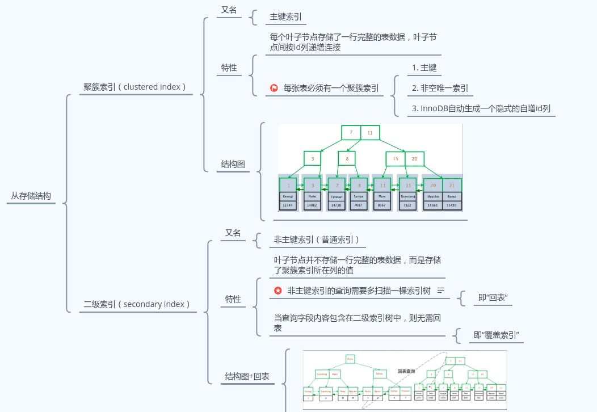
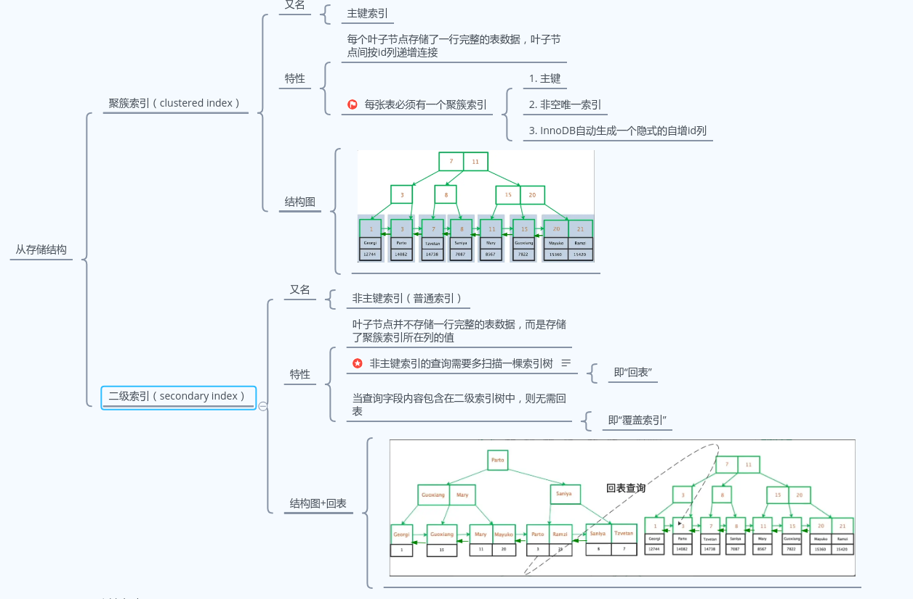
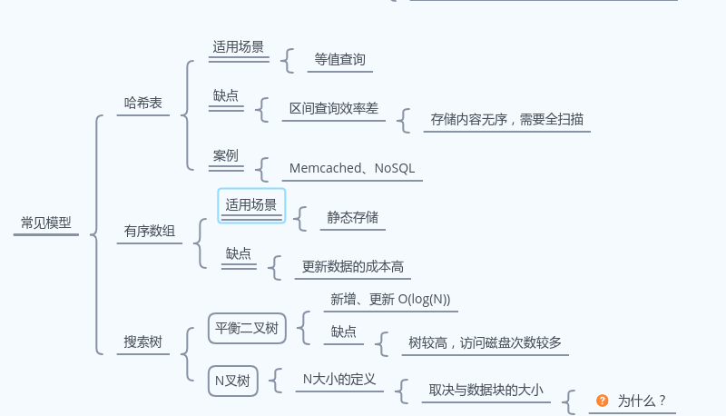

## Q1

```markdown
Q : 为什么mysql的默认隔离级别是repeatable read
```

```markdown
事务的隔离基本
```

## Q2

```markdown
Q : 为什么线上mysql隔离级别要从repeatable read改为read commited
```

```markdown

```

## Q3

```markdown
Q : 什么是间隙(GAP)锁和next-key锁？
```

```markdown
间隙锁：
    是为了解决在可重复读(Repeatable Reads)事务级别下的幻读问题的锁机制。
    幻读会导致在insert、delete中，不同时刻，数据总量可能不一致。这个问题的解决方法，但靠行锁无法解决问题，所有引入了对某范围的数据加锁的概念，
    来解决该问题，也就是对间隙锁的引入。
next-key锁：
    在insert、delete操作中，使用间隙锁避免了新插入值和删除值，同时也一样会使用行锁保证数据不被外部变更。而间隙锁加行锁则合称为next-key锁。

```

## Q4

```markdown
Q : 
    1. Mysql有哪些索引类型？
    2. 聚簇索引和非聚簇索引有什么区别？
    3. Mysql以什么数据结构存储索引？
```

```markdown

1.从存储结构上，可分为聚簇索引和非聚簇索引（及二级索引）。
  从字段特性上，可分为主键索引、唯一索引、普通索引、前缀索引。
```



```



```markdown
2. 


3.   
   Mysql以B+树为存储索引。
   在数据存储的索引模型中有以下几种，分别是哈希表、有序数组、搜索树。
对应mysql这种需要存储数据量大、访问频繁、查询场景多（包括范围查询），则选择搜索树是其中最为高效的数据结构。
   为了在大数据量下能有较好的查询效率，B树相比二叉树则更加高速。
   而为了存储优化IO查询速度，则选择B+树（不存储业务数据在非叶子节点）作为存储结构。


## Q5

```markdown
Q : 什么是B+树？B+树相对B树有什么特点？Mysql innodb为什么默认选择B+树作为索引存储结构
```

```markdown

   B树是多叉树又名平衡多路查找树，B+树则和B树类似，不同的是B+树的每个叶子结点都存有相邻叶子结点的指针，同时非叶子节点只保存索引数据，叶子节点保存索引数据与业务数据。
   B树每个节点都会存储业务数据，而业务数据的大小很有可能远远超过了索引数据，这也就加大了查询索引的开销。而使用B+树则可有效减少I/O 次数和每次获取有用的数据。这也就是innodb选择B+树为存储索引的原因。

```



## Q6

```markdown
Q : 假设有张表TableA有一个主键id，类型是INT，问：一棵4阶B+树最多可以存储多少数量的主键索引？
```

```markdown
mysql int占4字节
innodb 最小存储单元是页，一个页16kb
指针在innodb中为6字节
则16384/(4+6) = 1638.4 约为1638个指针
如果树高为2的b+树能存放 1638 * 16 = 26208 条数据
如果树高为3的b+树能存放 1638 * 1638 * 16 = 2,683,044条数据
```

## Q7

```markdown
Q : 使用union还是or？
```

```markdown

```

## Q8

```markdown
Q : 使用in、exists还是join？
```

```markdown

```

## Q9

```markdown
Q : 使用子查询还是join？
```

```markdown

```
