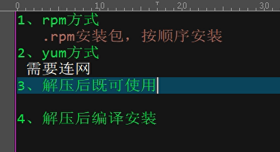

# MyCat

## 1.什么是MyCat

## 2.为什么要用MyCat

🔹 应用程序直接与数据库交互产生的问题
（1） 程序与数据库紧耦合。（数据库变化时，程序的配置需更改）
（2） 在高访问量下，使用多个数据库,会有读写不一致的问题。
（3） 单库，风险过高，
（4） 单表数据量存在瓶颈

🔹 针对以上问题：
（1）MyCat 可将Java程序对数据库的配置进行封装，使得程序只需访问MyCat，无需关注数据库的变化。类比设计模式中的门面模式。
（2）MyCat 可实现数据库读写分离，分发读写请求，且保证读写一致。控制各个数据库只进行读请求或写请求。
（3）双主双从，增加抗风险能力，实现高可用性。
（4）数据分片。单表存在瓶颈——分库
&emsp;&emsp;垂直拆分（分库）——将一个库中的表进行拆分到其它MySql
&emsp;&emsp;水平拆分（分表）——单表千万级别数据时，将一张表拆成多张表，分别在不同的MySql。

此外也可支持多数据源。

Linux vi命令

