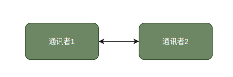
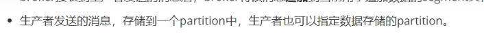
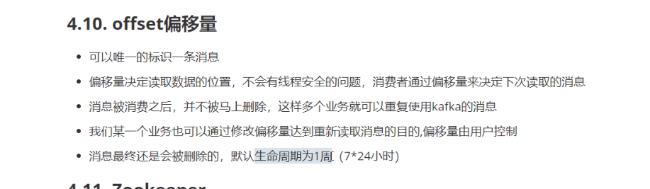

## 一、异步通讯

&emsp;&emsp;对于异步通讯的实现上，对简单的方式，通讯的双方直接进行交互，消息的发送方直接调用消费者方法传输数据或者消费者到发送方中获取数据。



<b type="h">缺点：</b>

- 耦合度高
- 两者间通讯中，消息的生产和消费速度不匹配
- 通讯双方的通讯是同步的。发送者调用消费者方法是同步的

### 生产者消费者模式

&emsp;&emsp;`生产者消费者模式`是一种多个生产者、消费者通过中间缓冲区进行通讯的模型。实现了生产者与消费者间的异步通讯和解耦合。


<b type="h">解决问题：</b>

- 去耦合。
    通过缓冲区作为中间消息容器，使用消费者与生产者间无需直接交互，而是分别与缓冲区交互即可完成消息的传输。
- 匹配消息生产速度与消费速度。
    消息暂存在中间容器中，解决消费速度跟不上生产速度所带来的问题。可通过多个消费者的同时、异步消费，以匹配生产速度。
- 支持并发
    由于中间容器的加入，生产者无需等待消费者完成消息的消费，可多次、异步地将数据发送到缓冲区。而消费者也可多线程地进行消息的消费。以此，可实现消息的并发处理。

## 二、kafka

### 1. 简介

&emsp;&emsp;`kafka`作为一个消息中间件，实现了`生产者消费者模式`的通讯。消息中间件一般可分为两种通讯方式，一种的点对点通讯，另一种是发布-订阅方式。`kafka`则是提供了`发布-订阅`的这种通讯方式，有着高效的消息处理能力,

<b type="h">kafka各数据的特点：</b>

- 可关联各自的业务对象
- 具有完整性
- 具有独立性
- 可控制颗粒度

&emsp;&emsp;对比其它消息中间件，`kafka`采用`pull模型`，提供消费者控制消费消息的速度以及进度的功能，消费者可通过修改消息偏移量对消息进行重复消费。

||Kafka|RabbitMQ|RocketMQ|
|-|-|-|-|
|Pull模型|√|√|√|
|Push模型||√|√|

### 2. Push模型与Pull模型

#### 2.1. Pull模型

&emsp;&emsp;Producer生产消息到服务端后，服务端不立即推送给Consumer消费。而是有Consumer来拉取数据。

<b type="h"> 1) 优点：</b>

- 消费速度快。消息可重新获取，传输失败无需重试。
- 消费速度可控。

<b type="h">2) 缺点点：</b>

- 消息实现性不确定。
  消费端若要时刻获取最新消息，需要以短轮询或长轮询的方式去获取数据，存在性能浪费、损耗。

#### 2.2. Push模型

&emsp;&emsp;Producer生产消息到服务器后，服务器则将消息推送到Consumer。

<b type="h">1) 优点：</b>

- 消息实时性高；

<b type="h">2) 缺点点：</b>

- 消息传输失败需重试，服务端需维护其消息状态
- 消息存在堆积的风险（消费者的消费速度跟不上等）。

## 三、kafka系统架构







### docker启动kafka

```bash
docker run -d --name zookeeper -p 2181:2181 -t wurstmeister/zookeeper

docker run -d --name kafka --publish 9092:9092 --link zookeeper \
    --env KAFKA_ZOOKEEPER_CONNECT=zookeeper:2181 \
    --env KAFKA_ADVERTISED_HOST_NAME=172.17.0.1 \
    --env KAFKA_ADVERTISED_PORT=9092 \
    --volume /etc/localtime:/etc/localtime \
    wurstmeister/kafka:latest
```

```bash
测试
docker exec -it ${CONTAINER ID} /bin/bash
cd /opt/kafka_2.13-2.7.0/bin/

生产
/kafka-console-producer.sh --broker-list localhost:9092 --topic mmr

写入消息
{"datas":[{"channel":"","metric":"temperature","producer":"ijinus","sn":"IJA0101-00002245","time":"1543207156000","value":"80"}],"ver":"1.0"}

消费
./kafka-console-consumer.sh --bootstrap-server localhost:9092 --topic mmr --from-beginning
```

### 数据检索


### 数据安全


