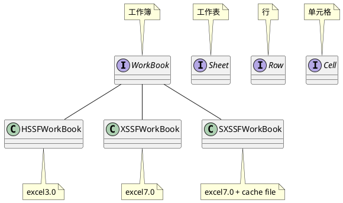
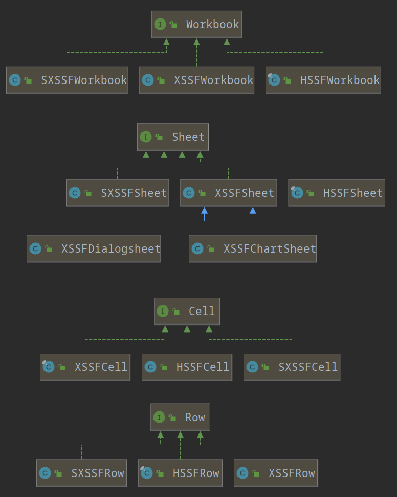

#

## 1. POI

### 1.1. 简介

POI是Apache下的一个使用Java对Office文档进行读写操作的工具

### 1.2. POI操作Excel

对与Excel的结构，我们可分为`工作簿、工作表、行、单元格`。其在POI中都有着对应的接口来表示，分别是`WorkBook、Sheet、Row、Cell`（见下类图）。而由于Excel3.0与Excel7.0的差异，POI中的这些接口大致分为三种实现类，`HSSF-实现类、XSSF-实现类、SXSSF-实现类`，以WorkBook接口为例，其有HSSFWorkBook、XSSFWorkBook、SXSSFWorkBook。三者差异如下：

|实现类|作用|
|-|-|
|HSSFWorkBook|处理Excel3.0|
|XSSFWorkBook|处理Excel7.0|
|SXSSFWorkBook|处理Excel7.0（加强版）<br> 优化XSSFWorkBook处理效率低的问题，<br>引入缓存文件（临时文件）|



<b>对Excel3.0 和 Excel7.0 操作的简要区别</b>

||Excel3.0|Excel7.0|
|-|-|-|
|可写入数量|65536行|1048576行|
|写入方式|`全部写入内存`，再解析|写入一定数量的内容到内存，<br/>（默认100行数据）<br/>多余的则`写入临时文件`中，<br/>再先对内存中的内容解析|

<b>完整类图</b>



#### 1.2.1. 写入Excel

使用POI写入Excel时，需先创建WorkBook对象，再通过WorkBook选择工作表Sheet，Sheet再选择行Row，最后Row选择Cell，以此定位到excel中的单元格Cell。
定位到单元格后，即可对单元格进行相应操作，之后再写入文件。

以下代码用于操作Excel3.0的文件。
对于操作Excel7.0，则将HSSFWorkbook改为XSSFWorkbook实现类即可，但是这个的处理效率很低，可使用SXSSWorkbook实现类来替换，而由于SXSSWorkbook会产生缓存文件，所以在操作的最后，可使用`((SXSSFWorkbook) workbook).dispose()`对缓存文件进行清除。

<b>操作Excel3.0</b>

```java
@Test
public void testWrite03() throws IOException {
    // 1. 创建新的Excel 工作簿
    Workbook workbook = new HSSFWorkbook();
    // 2. 在Excel工作簿中建一工作表
    Sheet sheet = workbook.createSheet("统计表");

    // 3. 创建行（row_1）
    Row row_1 = sheet.createRow(0);
    // 4. 创建单元格（col 1-1）
    Cell cell11=row_1.createCell(0);
    //      写入数据
    cell11.setCellValue("数量");
    // 4. 创建单元格（col 1-2）
    Cell cell12=row_1.createCell(1);
    cell12.setCellValue(999);

    // 创建行（row2）
    Row row2=sheet.createRow(1);
    //  创建单元格（col 2-1）
    Cell cell21=row2.createCell(0);
    cell21.setCellValue("统计时间");
    // 创建单元格（第三列）
    Cell cell22=row2.createCell(1);
    String dateTime=new DateTime().toString("yyyy-MM-dd HH:mm:ss");
    cell22.setCellValue(dateTime);


    // 新建一输出文件流（注意：要先创建文件夹）
    FileOutputStream out=
        new FileOutputStream("/home/jianxi/IdeaProjects/.../统计表.xls");
    // 把相应的Excel 工作簿存盘
    workbook.write(out);
    // 操作结束，关闭文件
    out.close();
    System.out.println("文件生成成功");
}
```

<b>操作Excel7.0</b>

```java
@Test
public void testWrite() throws Exception {
    long startTime = System.currentTimeMillis();
    long endTime = 0;
    // 创建新的Excel 工作簿
    // excel 3
    //Workbook workbook = new HSSFWorkbook();
    // excel 7
    // Workbook workbook = new XSSFWorkbook();
    // excel 7 with cache
    Workbook workbook = new SXSSFWorkbook();
    // 在Excel工作簿中建一工作表
    Sheet sheet = workbook.createSheet("统计表");

    // 创建行（row1）
    Row row_1 = sheet.createRow(0);
    // 创建单元格（col 1-1）
    Cell cell11=row_1.createCell(0);
    cell11.setCellValue("用户名称");
    // 创建单元格（col 1-2）
    Cell cell12=row_1.createCell(1);
    cell12.setCellValue("id");

    for (int i = 0; i < 1048576; i++) {
        Row row = sheet.createRow(i);
        row.createCell(0).setCellValue("user_"+i);
        row.createCell(1).setCellValue("id_"+i);
    }

    // 新建一输出文件流（注意：要先创建文件夹）
    FileOutputStream out= new FileOutputStream(path+"统计表07_mul_cache.xlsx");
    // 把相应的Excel 工作簿存盘
    workbook.write(out);
    // 操作结束，关闭文件
    out.close();
    // 清除缓存文件
    ((SXSSFWorkbook) workbook).dispose();

    //System.out.println("文件生成成功");

    endTime = System.currentTimeMillis();
    System.out.println("time(s):"+(endTime - startTime) / 1000);
}

```

#### 1.2.2. 读取Excel

使用POI读取Excel的操作与写入Excel类似，需先通过excel文件的IO流生成对应的WorkBook对象，再以此定位到单元格Cell，进行读取操作。

而对于单元格的读取，需先判断其数据类型，在进行相应类型的读取操作。

|类型|类型判断依据|cell中的获取方法|
|-|-|-|
|数字|Cell.CELL_TYPE_NUMERIC|getNumericCellValue()|
|日期|是数字并且<br>HSSFDateUtil.isCellDateFormatted (cell)==true|getDateCellValue()|
|字符串|Cell.CELL_TYPE_STRING|getStringCellValue()|
|boolean|Cell.CELL_TYPE_BOOLEAN|getBooleanCellValue()|
|空|Cell.CELL_TYPE_BLANK||
|计算公式|Cell.CELL_TYPE_FORMULA| 1.获取计算器 <br> workbook.getCreationHelper()<br>   .createFormulaEvaluator();<br>2.使用计算器计算<br>formulaEvaluator.evaluate(cell)|

<b>获取单元格的数据</b>

```java
public static String getData(Cell cell, FormulaEvaluator formulaEvaluator) {
    int cellStyle = cell.getCellType();

    String value = "";
    switch (cellStyle) {
        // 数字
        case Cell.CELL_TYPE_NUMERIC:
            // 日期
            if (HSSFDateUtil.isCellDateFormatted(cell)) {
                Date date = cell.getDateCellValue();
                value = new DateTime(date).toString("yyyy-MM-dd");
            } else {
                //cell.setCellType(Cell.CELL_TYPE_STRING);
                double cellValue = cell.getNumericCellValue();
                value = String.valueOf(cellValue);
            }
            break;
        //  字符串
        case Cell.CELL_TYPE_STRING:
            value = cell.getStringCellValue();
            break;
        //    boolean
        case Cell.CELL_TYPE_BOOLEAN:
            value = String.valueOf(cell.getBooleanCellValue());
            break;
        //    空
        case Cell.CELL_TYPE_BLANK:
            value = "";
            break;
        //    计算公式
        case Cell.CELL_TYPE_FORMULA:
            // 公式
            String cellFormula = cell.getCellFormula();
            // 计算器

            // 计算结果
            CellValue cellValue = formulaEvaluator.evaluate(cell);
            value = String.valueOf(cellValue.getNumberValue());
            break;
        //    类型错误
        case Cell.CELL_TYPE_ERROR:
            value = null;
            break;
    }

    return value;
}
```

<b>完整示例</b>

```java
@Test
public void read03() throws IOException {
    FileInputStream fileInputStream =
        new FileInputStream("/home/jianxi/.../user.xlsx");

    XSSFWorkbook workbook = new XSSFWorkbook(fileInputStream);
    //FormulaEvaluator formulaEvaluator = new XSSFFormulaEvaluator(workbook);
    // 获取计算器
    FormulaEvaluator formulaEvaluator = workbook.getCreationHelper().createFormulaEvaluator();

    //workbook.getSheet("sheet1");
    Sheet sheet = workbook.getSheetAt(0);

    int numberOfRows = sheet.getPhysicalNumberOfRows();
    for (int i = 0; i < numberOfRows; i++) {
        Row row = sheet.getRow(i);
        if (row != null) {
            //int numberOfCells = row.getPhysicalNumberOfCells();
            int numberOfCells = row.getLastCellNum();
            for (int j = 0; j < numberOfCells; j++) {
                Cell cell = row.getCell(j);
                if (cell != null) {
                    String data = getData(cell, formulaEvaluator);
                    System.out.print(data + " | ");
                    //System.out.printf("%s | \t",data);
                } else {
                    System.out.print(" | ");
                }
            }
            System.out.println();
        }
    }
}

// 根据单元格的数据类型来获取数据
public static String getData(Cell cell, FormulaEvaluator formulaEvaluator) {
    int cellStyle = cell.getCellType();

    String value = "";
    switch (cellStyle) {
        // 数字
        case Cell.CELL_TYPE_NUMERIC:
            // 日期
            if (HSSFDateUtil.isCellDateFormatted(cell)) {
                Date date = cell.getDateCellValue();
                value = new DateTime(date).toString("yyyy-MM-dd");
            } else {
                //cell.setCellType(Cell.CELL_TYPE_STRING);
                double cellValue = cell.getNumericCellValue();
                value = String.valueOf(cellValue);
            }
            break;
        //  字符串
        case Cell.CELL_TYPE_STRING:
            value = cell.getStringCellValue();
            break;
        //    boolean
        case Cell.CELL_TYPE_BOOLEAN:
            value = String.valueOf(cell.getBooleanCellValue());
            break;
        //    空
        case Cell.CELL_TYPE_BLANK:
            value = "";
            break;
        //    计算公式
        case Cell.CELL_TYPE_FORMULA:
            // 公式
            String cellFormula = cell.getCellFormula();
            // 计算器

            // 计算结果
            CellValue cellValue = formulaEvaluator.evaluate(cell);
            value = String.valueOf(cellValue.getNumberValue());
            break;
        //    类型错误
        case Cell.CELL_TYPE_ERROR:
            value = null;
            break;
    }

    return value;
}
```

## 2. EasyExcel

EasyExcel是alibaba对Apache POI进行升级的一个工具。由于EasyExcel是对Excel进行单行写入内存再解析，其相比POI的占用内存更少，处理效率更高。且EasyExcel对Excel的数据的封装、操作是基于java数据模型，不同于POI需要操作Workbook、row、cell多个类，因此EasyExcel的操作也更为便捷。

EasyExcel的相关操作见更为详细的[官方文档](https://www.yuque.com/easyexcel/doc/read)