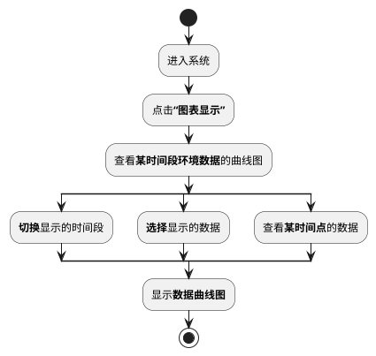
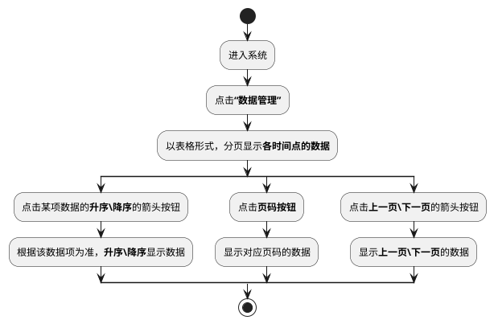
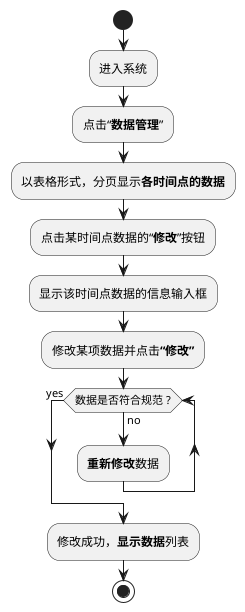
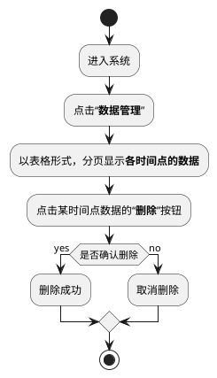
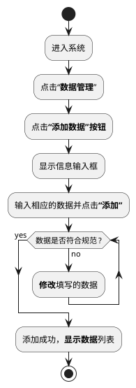
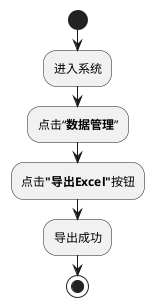

# 物联网项目流程图

## 1. 图表显示数据

```puml
@startuml
start

:进入系统;
:点击**“图表显示”**;
:查看**某时间段环境数据**的曲线图;
    split
        :**切换**显示的时间段;
    split again
        :**选择**显示的数据;
    split again
        :查看**某时间点**的数据;
    end split
:显示**数据曲线图**;

stop
@enduml
```

## 2. 表格显示数据

```puml
@startuml
start

:进入系统;
:点击**“数据管理”**;
:以表格形式，分页显示**各时间点的数据**;
    split
        :点击某项数据的**升序\降序**的箭头按钮;
        :根据该数据项为准，**升序\降序**显示数据;
    split again
        :点击**页码按钮**;
        :显示对应页码的数据;
    split again
        :点击**上一页\下一页**的箭头按钮;
        :显示**上一页\下一页**的数据;
    end split

stop
@enduml
```

## 3. 编辑数据

```puml
@startuml
start

:进入系统;
:点击“**数据管理**”;
:以表格形式，分页显示**各时间点的数据**;
:点击某时间点数据的“**修改**”按钮;
:显示该时间点数据的信息输入框;
:修改某项数据并点击**“修改”**;
while (数据是否符合规范 ?) is (no)
  :**重新修改**数据;
endwhile (yes)
:修改成功，**显示数据**列表;

stop
@enduml
```

## 4. 删除数据

```puml
@startuml
start

:进入系统;
:点击“**数据管理**”;
:以表格形式，分页显示**各时间点的数据**;
:点击某时间点数据的“**删除**”按钮;
if (是否确认删除) then (yes)
:删除成功;
else (no)
:取消删除;
endif

stop
@enduml
```

## 5. 新增数据

```puml
@startuml
start

:进入系统;
:点击“**数据管理**”;
:点击**“添加数据”按钮**;
:显示信息输入框;
:输入相应的数据并点击**“添加”**;
while (数据是否符合规范 ?) is (no)
  :**修改**填写的数据;
endwhile (yes)
:添加成功，**显示数据**列表;

stop
@enduml
```

## 6. 导出含所有数据的excel文件

```puml
@startuml
start

:进入系统;
:点击“**数据管理**”;
:点击**"导出Excel"**按钮;
:导出成功;

stop
@enduml
```