## WBS图

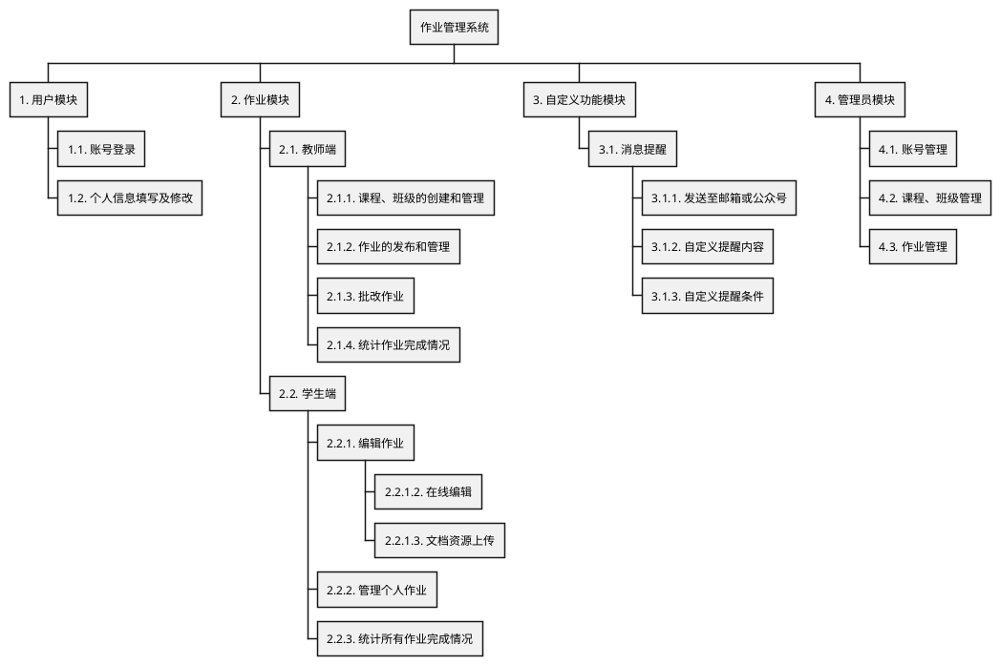
```puml

@startwbs
* 作业管理系统
** 1. 用户模块
*** 1.1. 账号登录
*** 1.2. 个人信息填写及修改
** 2. 作业模块
*** 2.1. 教师端
**** 2.1.1. 课程、班级的创建和管理
**** 2.1.2. 作业的发布和管理
**** 2.1.3. 批改作业
**** 2.1.4. 统计作业完成情况
*** 2.2. 学生端
**** 2.2.1. 编辑作业
***** 2.2.1.2. 在线编辑
***** 2.2.1.3. 文档资源上传
**** 2.2.2. 管理个人作业
**** 2.2.3. 统计所有作业完成情况
** 3. 自定义功能模块
*** 3.1. 消息提醒
**** 3.1.1. 发送至邮箱或公众号
**** 3.1.2. 自定义提醒内容
**** 3.1.3. 自定义提醒条件
** 4. 管理员模块
*** 4.1. 账号管理
*** 4.2. 课程、班级管理
*** 4.3. 作业管理

@endwbs
```

## 用例图

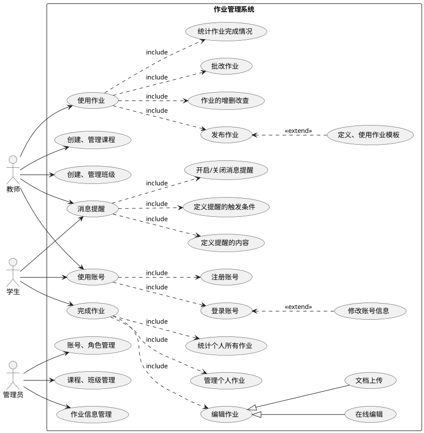
```puml
@startuml
left to right direction
skinparam packageStyle rectangle

actor 教师
actor 学生
actor 管理员

rectangle 作业管理系统 {
    教师 --> (使用账号)
    学生 --> (使用账号)
    (使用账号) ..> (登录账号)       : include
    (使用账号) ..> (注册账号)       : include
    (登录账号) <.. (修改账号信息)   : <<extend>>

    教师 --> (使用作业)

    (使用作业) ..> (发布作业)           : include
    (发布作业) <.. (定义、使用作业模板)  : <<extend>>
    (使用作业) ..> (作业的增删改查)      : include
    (使用作业) ..> (批改作业)           : include
    (使用作业) ..> (统计作业完成情况)    : include

    教师 --> (创建、管理课程)
    教师 --> (创建、管理班级)


    学生 --> (完成作业)
    (完成作业) ..> (编辑作业)       : include
    (编辑作业) <|-- (在线编辑)
    (编辑作业) <|-- (文档上传)
    (完成作业) ..> (管理个人作业)   : include
    (完成作业) ..> (统计个人所有作业): include

    教师 --> (消息提醒)
    学生 --> (消息提醒)
    (消息提醒) ..> (开启/关闭消息提醒)  : include
    (消息提醒) ..> (定义提醒的内容)     : include
    (消息提醒) ..> (定义提醒的触发条件)  : include

    管理员 --> (账号、角色管理)
    管理员 --> (课程、班级管理)
    管理员 --> (作业信息管理)

}
@enduml

```

## 时序图

### 登录

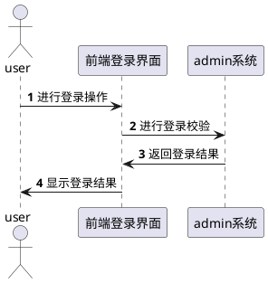
```puml
@startuml
autonumber

actor user
user -> 前端登录界面 :进行登录操作
前端登录界面 -> admin系统 :进行登录校验 
前端登录界面 <- admin系统 :返回登录结果
user <- 前端登录界面 :显示登录结果

@enduml
```

### 退出

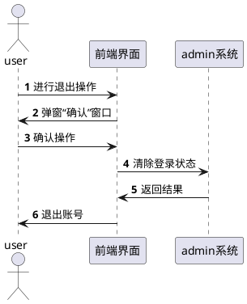
```puml
@startuml
autonumber

actor user
user -> 前端界面 :进行退出操作
user <- 前端界面 :弹窗“确认”窗口
user -> 前端界面 :确认操作
前端界面 -> admin系统 :清除登录状态
前端界面 <- admin系统 :返回结果
user <- 前端界面 :退出账号

@enduml
```

### 修改密码功能

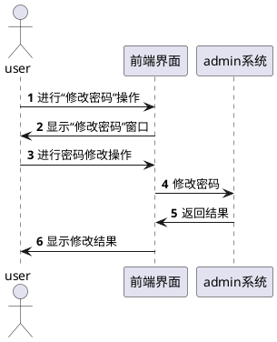
```puml
@startuml
autonumber

actor user
user -> 前端界面 :进行“修改密码”操作
user <- 前端界面 :显示“修改密码”窗口
user -> 前端界面 :进行密码修改操作
前端界面 -> admin系统 :修改密码
前端界面 <- admin系统 :返回结果
user <- 前端界面 :显示修改结果

@enduml
```

### 作业管理

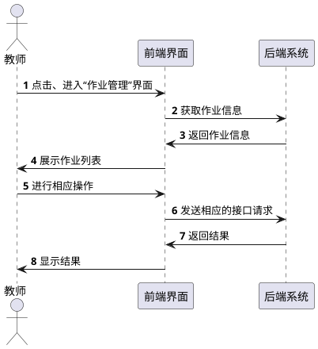
```puml
@startuml
autonumber

actor 教师
教师 -> 前端界面 :点击、进入“作业管理”界面
前端界面 -> 后端系统 :获取作业信息
前端界面 <- 后端系统 :返回作业信息
教师 <- 前端界面 : 展示作业列表
教师 -> 前端界面 :进行相应操作
前端界面 -> 后端系统 :发送相应的接口请求
前端界面 <- 后端系统 :返回结果
教师 <- 前端界面 :显示结果

@enduml
```

### 题目管理

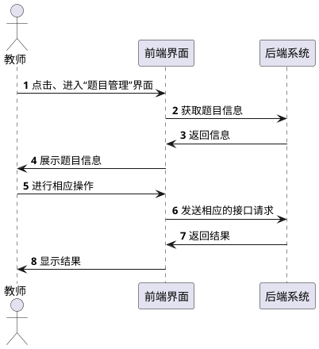
```puml
@startuml
autonumber

actor 教师
教师 -> 前端界面 :点击、进入“题目管理”界面
前端界面 -> 后端系统 :获取题目信息
前端界面 <- 后端系统 :返回信息
教师 <- 前端界面 : 展示题目信息
教师 -> 前端界面 :进行相应操作
前端界面 -> 后端系统 :发送相应的接口请求
前端界面 <- 后端系统 :返回结果
教师 <- 前端界面 :显示结果

@enduml
```

### 发布、编辑作业

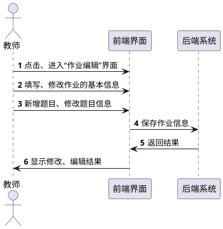
```puml
@startuml
autonumber

actor 教师
教师 -> 前端界面 :点击、进入“作业编辑”界面
教师 -> 前端界面 :填写、修改作业的基本信息
教师 -> 前端界面 :新增题目、修改题目信息
前端界面 -> 后端系统 :保存作业信息
前端界面 <- 后端系统 :返回结果
教师 <- 前端界面 :显示修改、编辑结果

@enduml
```

### 管理个人作业

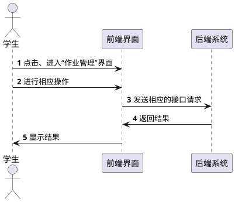
```puml
@startuml
autonumber

actor 学生
学生 -> 前端界面 :点击、进入“作业管理”界面
学生 -> 前端界面 :进行相应操作
前端界面 -> 后端系统 :发送相应的接口请求
前端界面 <- 后端系统 :返回结果
学生 <- 前端界面 :显示结果

@enduml
```

### 信息提醒

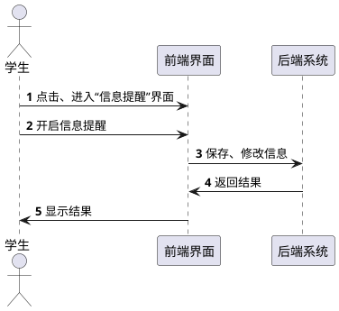
```puml
@startuml
autonumber

actor 学生
学生 -> 前端界面 :点击、进入“信息提醒”界面
学生 -> 前端界面 :开启信息提醒
前端界面 -> 后端系统 :保存、修改信息
前端界面 <- 后端系统 :返回结果
学生 <- 前端界面 :显示结果

@enduml
```

### 系统角色管理

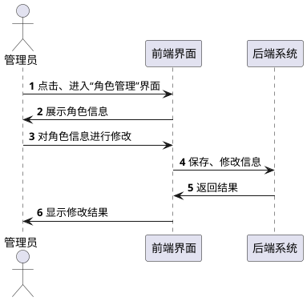
```puml
@startuml
autonumber

actor 管理员
管理员 -> 前端界面 :点击、进入“角色管理”界面
管理员 <- 前端界面 : 展示角色信息
管理员 -> 前端界面 :对角色信息进行修改
前端界面 -> 后端系统 :保存、修改信息
前端界面 <- 后端系统 :返回结果
管理员 <- 前端界面 :显示修改结果

@enduml
```

### 系统菜单管理

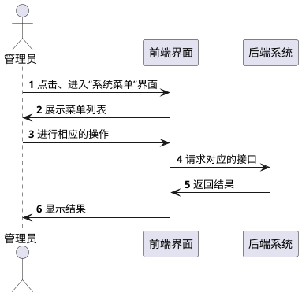
```puml
@startuml
autonumber

actor 管理员
管理员 -> 前端界面 :点击、进入“系统菜单”界面
管理员 <- 前端界面 : 展示菜单列表
管理员 -> 前端界面 :进行相应的操作
前端界面 -> 后端系统 :请求对应的接口
前端界面 <- 后端系统 :返回结果
管理员 <- 前端界面 :显示结果

@enduml
```

### 系统SQL日志管理

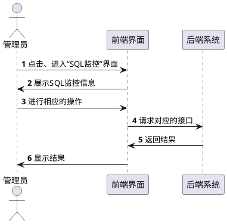
```puml
@startuml
autonumber

actor 管理员
管理员 -> 前端界面 :点击、进入“SQL监控”界面
管理员 <- 前端界面 : 展示SQL监控信息
管理员 -> 前端界面 :进行相应的操作
前端界面 -> 后端系统 :请求对应的接口
前端界面 <- 后端系统 :返回结果
管理员 <- 前端界面 :显示结果

@enduml
```