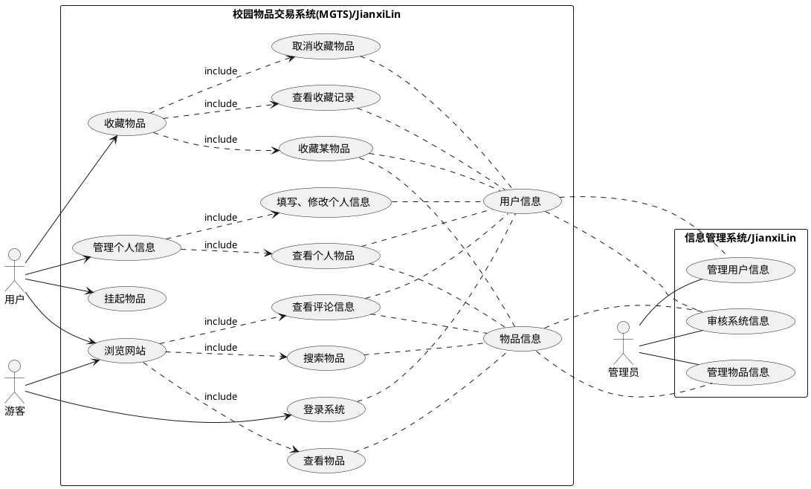

# 系统用例

```puml

skinparam backgroundColor Beige

@startuml
left to right direction
skinparam packageStyle rectangle

actor 用户
actor 管理员
actor 游客

rectangle 校园物品交易系统(MGTS)/JianxiLin {
  游客 --> (登录系统)
  游客 --> (浏览网站)

  用户 --> (浏览网站)
  
  用户 --> (挂起物品)
  用户 --> (管理个人信息)
  用户 --> (收藏物品)

  (管理个人信息) ..> (填写、修改个人信息) : include
  (管理个人信息) ..> (查看个人物品) : include

  (收藏物品) ..> (收藏某物品) : include
  (收藏物品) ..> (取消收藏物品) : include
  (收藏物品) ..> (查看收藏记录) : include

  (浏览网站) ..> (搜索物品) : include
  (浏览网站) ..> (查看物品) : include
  (浏览网站) ..> (查看评论信息) : include
  
  (查看物品) ... (物品信息)
  (查看评论信息) ... (物品信息)
  (查看评论信息) ... (用户信息)
  (搜索物品) ... (物品信息)
  (收藏某物品) ... (用户信息)
  (收藏某物品) ... (物品信息)
  (取消收藏物品) ... (用户信息)
  (查看个人物品) ... (物品信息)
  (查看个人物品) ... (用户信息)
  (填写、修改个人信息) ... (用户信息)
  (查看收藏记录) ... (用户信息)
  (登录系统) ... (用户信息)
}

rectangle 信息管理系统/JianxiLin {
    (物品信息) ... (管理物品信息)
    (用户信息) ... (管理用户信息)
    (物品信息) ... (审核系统信息)
    (用户信息) ... (审核系统信息)
    管理员 -- (审核系统信息)
    管理员 -- (管理用户信息)
    管理员 -- (管理物品信息)
}


@enduml

```
