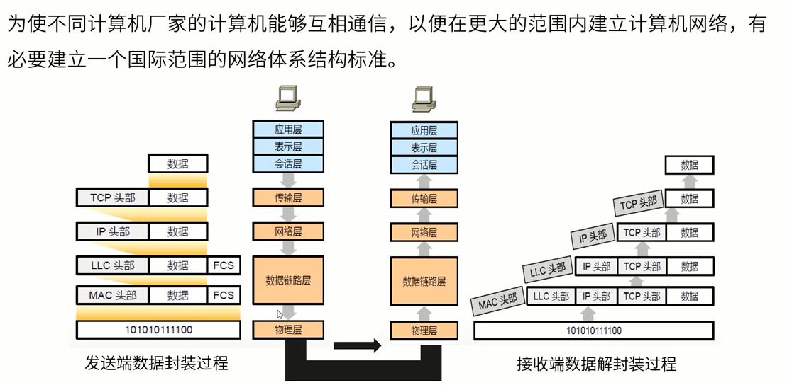
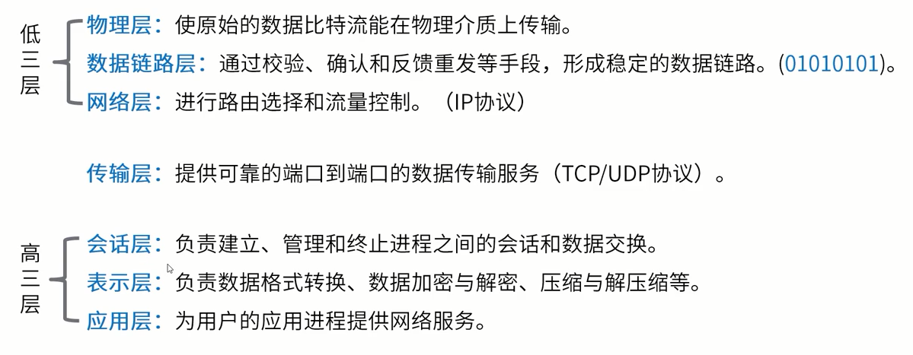
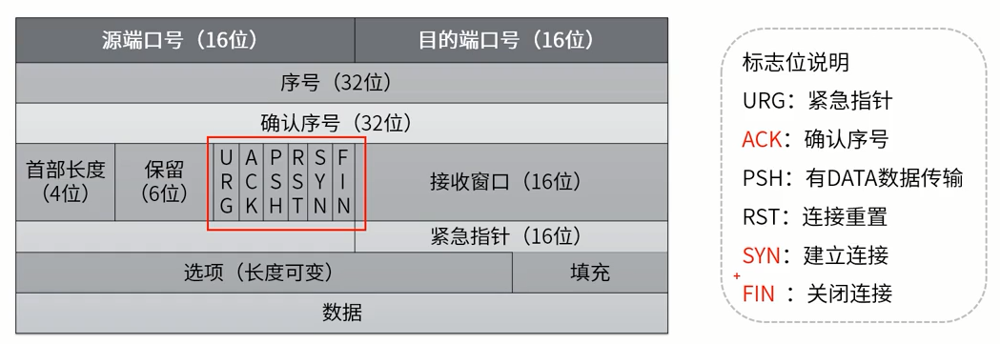
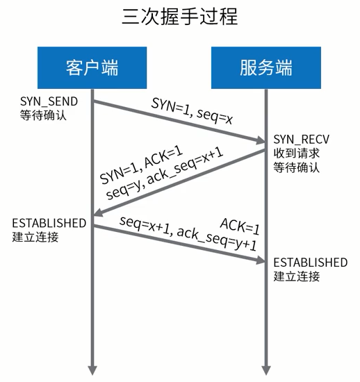
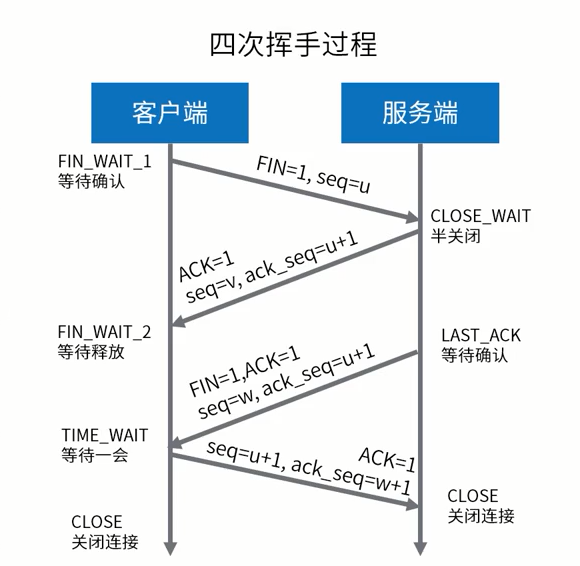
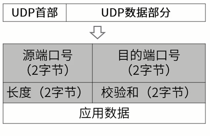
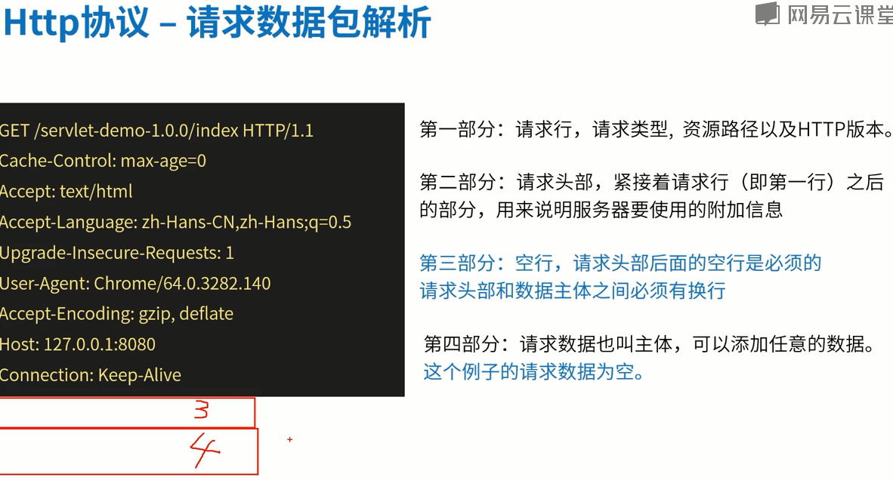
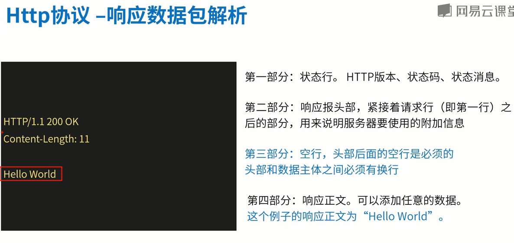
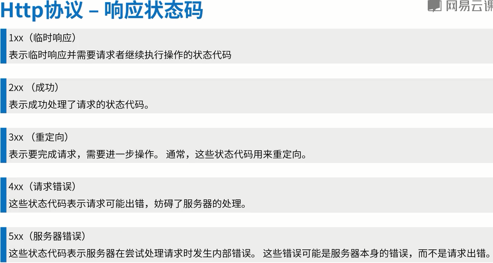

# 七层模型及传输层

## 一、七层模型

### 1、模型图

### 2、各层描述

## 二、传输层

### 1、传输控制协议TCP

面向连接、可靠、有序、字节流传输服务。

#### 1.1、报文

#### 1.2、TCP三次握手

确认连接

#### 1.3、TCP四次挥手

断开连接

### 2、UDP

面向无连接、不可靠、尽力传输、速度快、占用资源相对少

#### 2.1、报文

## 四、Http协议

