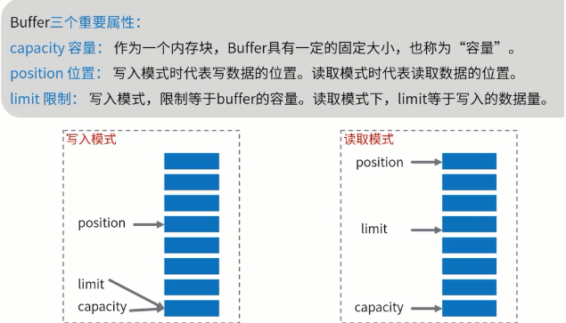
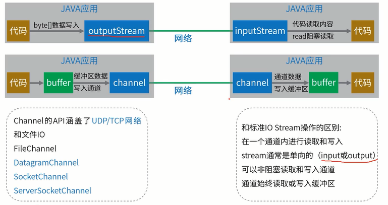
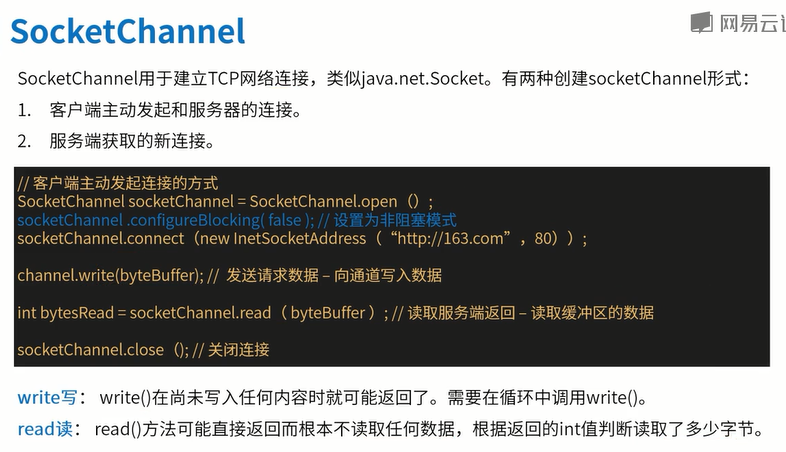
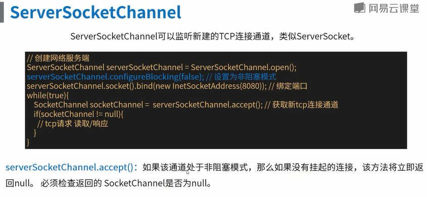
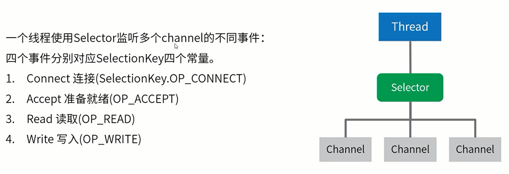

# NIO

    非阻塞IO操作的API（java1.4）
    
- NIO中有三个核心组件
    Buffer缓冲区
    Channe通道
    Selector选择器

## 1、Buffer缓冲区

    可以写入数据的内存块。相比数组，Buffer API更容易操作和管理

### 1.1 使用 Buffer进行数据写入与读取,需要进行如下四个步骤

    1.将数据写入缓冲区
    2.调用 buffer.flip(),转换为读取模式
    3.缓冲区读取数据
    4.调用 buffer.clean() 或 buffer.compact()清除缓冲区

### 1.2 Buffer工作原理

    切换到写时,需调用buffer.flip(),将position位置重新回到开头。
    buffer.compact()清除已读数据的缓存  

### 1.3 ByteBuffer内存类型

直接内存(direct堆外)、非直接内存(heap堆)

#### （1）堆外内存获取的方式

ByteBuffer directByteBuffer=ByteBuffer.allocateDirect(noBytes);

#### （2）区别

- 堆内：受GC自动管理,GC垃圾回收前，会拷贝一份到堆外。
    (file/socket--OS memory-- jvm heap)

- 堆外: 相比堆内，堆外内存的性能跟高，降低了GC压力。
    需要手动触发GC垃圾回收。
    DirectByteBuffer中的Cleaner对象
    Cleaner被GC前会执行clean方法,触发 DirectByte Buffer中定义的 Deallocator

#### （3）堆内为什么要拷贝一份🤔

这是因为垃圾回收机制中，会将移动内容地址，导致地址发生改变。
为了防止，外部掉用时，地址错位，所以==JVM会先复制一份到堆外
在写入==。

#### （4）使用堆外内存的建议

1、性能确实可观的时候才去使用;分配给大型、长寿命;(网络传输、文件读写场景)
2、通过虚拟机参数 MaxDirectMemorysize限制大小,防止耗尽整个机器的内存

### 1.4 相关方法

    put(-)、get()
    wrap(byte[] array, int offset, int length)  将array写入

    flip() 位置设置为0，翻转。
    clear() 位置设置为0，同时清空
    compact() 清除已读数据，将未读数据置前，位置设置到未读数据后。
    rewind() 位置设置为0，标记清除

    hasRemaining() 是否有剩余

    mark() 标记当前
    reset() 回到标记

## 2、Channel通道

### 2.1 介绍图

### 2.2 相关方法

    configureBlocking(boolean)
    read(Buffer)

    isOpen()

## 3、Selector

selector用于管理多个通道，即管理多个线程。

### 3.1 原理图

### 3.2 
